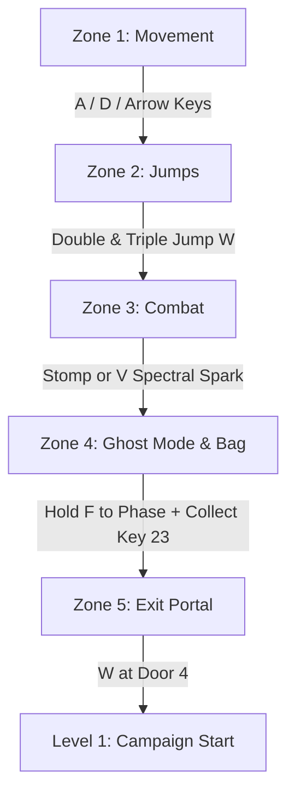
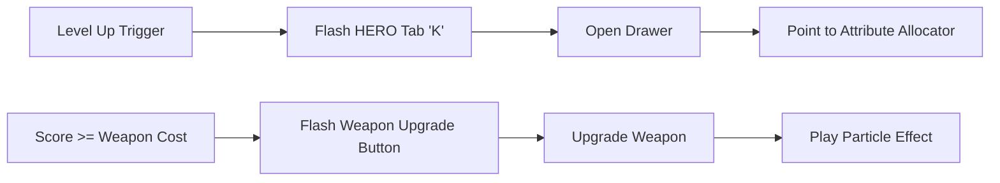

# Danger Ghost: Interactive Onboarding & Tutorial Architecture Blueprint

This document defines the game design, user flow, and implementation plan for the **Danger Ghost** interactive tutorial system. It covers the dedicated Level 0 tutorial flow, the UI/UX visual guidance overlay, and the gamified explanations for Web3 integrations.

---

## 1. Dedicated Interactive Tutorial: Level 0 ("Limbus")

To prevent cognitive overload, the onboarding process introduces movement, jump mechanics, combat, active skills, inventory, and doors sequentially. Level 0 is a structured obstacle course where new mechanics are unlocked only after the player demonstrates proficiency.

### Level 0 ASCII Map Layout
```text
[Row 0] . . . . . . . . . . . . . . . . . . . . . . . . . . . . . . . . . . . . . . . . . . . . . . . . . .
[Row 1] . . . . . . . . . . . . . . . . . . . . . . . . . . . . . . . . . . . . . . . . . . . . . . . . . .
[Row 2] . . . . . . . . . . . . . . . . . . . . . . . . . . . . . . . . . . . . . . . . . . . . . . . . . .
[Row 3] . . . . . . . . . . . . . . . . . . . . . . . . . . . . . . . . . . . [23] . . . . . . . . . . . . .
[Row 4] . . . . . . . . . . . . . . . . . . . [2] . . . . . . . . . . . . . [1][1][1] . . . . . . . . . . .
[Row 5] . . . . . . . . . . . . . . . . . . . . . . . . . . . . . . . . . . [1]   [1] . . . . . . . . . . .
[Row 6] . . . . . . . . . . . . . . . [2] . . . . . . . . . . . . . . . . . [1]   [1] . . . . . . . [4] . .
[Row 7] . . . . . . . . . . . . . . . . . . . . . . . [E] . . . . . . . . . [1]   [1] . . . . . . [1][1] .
[Row 8] [1][1][1][1][1][1][1] . . . . . . . . . . [1][1][1][1][1] . . . . . [1] F [1] . . . . . [1][1][1][1]
[Row 9] [1][1][1][1][1][1][1] . . . . . . . . . . [1][1][1][1][1] . . . . . [1][1][1] . . . . . [1][1][1][1]
        |-- ZONE 1: MOVE --|-- ZONE 2: JUMPS --|-- ZONE 3: COMBAT -|--- ZONE 4: GHOST ---|-- ZONE 5: EXIT -|
```
*   `[1]`: Solid Brick Tile
*   `[2]`: Floating Platform Tile
*   `[E]`: Crow Enemy (Weakened Tutorial version)
*   `[23]`: Blue Key item
*   `F`: Solid Wall requiring Ghost Mode phasing
*   `[4]`: Exit Door (leads to Level 1)

---

### Step-by-Step Level 0 Walkthrough Flow



#### Zone 1: Movement & Basic Ground Rules
*   **Objective:** Teach left/right movement.
*   **Player State:** Locked in Zone 1 by an invisible barrier.
*   **Tutorial Prompt (Screen Center Overlay):** 
    > 💡 **"A / D or LEFT / RIGHT ARROW KEYS to slide your Ghost left and right."**
*   **Trigger to Advance:** Move 100 pixels to the right. Once met, the invisible barrier dissipates with a brief green particle burst.

#### Zone 2: Platforming & Triple Jump Mastery
*   **Objective:** Teach the triple-jump mechanic (`W` or `Up Arrow`).
*   **Obstacle:** A low gap followed by a high platform structure that cannot be scaled with a single jump.
*   **Tutorial Prompt:**
    > 💡 **"Press W or UP ARROW in mid-air to jump again. You can jump up to 3 times sequentially!"**
*   **On-Screen Feedback:** Visual numbers pop up directly above the Ghost's head: `1st Jump!`, `2nd Jump!`, `3rd Jump!` to confirm jump consumption.
*   **Trigger to Advance:** Safely land on the high platform (Row 4, Column 20).

#### Zone 3: Combat & Mana Generation
*   **Objective:** Teach stomp attacks, casting Spectral Spark (`V`), and mana collection.
*   **Obstacle:** A low-health Crow enemy (`[E]`) patrols the floor.
*   **Tutorial Prompt:**
    > 💡 **"Press V to fire SPECTRAL SPARK. Hitting enemies replenishes your MANA bar! Alternatively, jump and stomp on its head."**
*   **On-Screen Feedback:** When hitting the boss with Spark, float text: `+Mana!` above the player. If stomp is performed: floating damage indicator `STOMP!`.
*   **Trigger to Advance:** Defeat the patrol crow. Defeating the crow unlocks the gate to Zone 4.

#### Zone 4: Phasing (Ghost Mode) & Inventory Collection
*   **Objective:** Teach Ghost Mode (`F`) and picking up quest items.
*   **Obstacle:** The player faces a solid vertical brick pillar. Inside the pillar is a hollow chamber containing the **Blue Key** (`[23]`).
*   **Tutorial Prompt:**
    > 💡 **"Hold F to activate GHOST MODE. It drains mana but lets you phase through solid walls. Go inside and fetch the Blue Key!"**
*   **On-Screen Feedback:** The Ghost's transparency shifts to 50% opacity (`g_ctx.globalAlpha = 0.5`) and a purple trail follows the avatar. Picking up the key fires a notification: 
    > `🔑 Item Acquired: Blue Key! Opens secret doors.`
*   **Trigger to Advance:** Successfully phase through the pillar, collect the key, and exit the other side.

#### Zone 5: Exit Portal Mechanics
*   **Objective:** Teach exit door activation.
*   **Obstacle:** The level exit door (`tile 4`).
*   **Tutorial Prompt:**
    > 💡 **"Stand in front of the door and press W (or UP ARROW) to enter Level 1."**
*   **Trigger to Advance:** Press jump key on the door tile to transition to Level 1.

---

## 2. UI/UX Highlights & Guidance Overlay

Navigating the various RPG panels (HERO, BAG, EQUIP) and connecting web wallets can be daunting. The visual guidance overlay points out interactive tabs at specific gameplay triggers.



### Visual Highlights & Alerts Specifications

| UI Element | Trigger Condition | Visual Styling | Action Required by Player |
| :--- | :--- | :--- | :--- |
| **HERO Tab** (`btnNavRPG`) | Level up occurred / Stat points are available | Glowing green outline around the tab, flashing at 2Hz. Font color oscillates green/yellow. | Press `K` or click the tab to open the Hero Status drawer. |
| **Attribute Allocators** (`+` buttons) | RPG drawer is open with unallocated points | Pulsating gold border around the upgrade arrow next to attributes (`VIT`, `AGI`, `INT`, `POW`, `MAG`). | Click `+` to allocate attributes. |
| **BAG Tab** (`btnNavBag`) | Quest item (e.g., Blue Key, Spell Scroll) acquired | Blue alert badge with a exclamation point `!` on the bag tab icon. | Click the BAG tab to inspect newly acquired items. |
| **Weapon Upgrade Button** | Score $\ge$ Weapon Upgrade Cost (`tier * 2000`) | Neon pink button border with a label reading `UPGRADE READY!`. | Click the Upgrade button to spend score and gain attack power. |
| **DeSo Wallet Button** (`desoBtn`) | Game starts and wallet is disconnected | Pulsating purple warning border with text `CONNECT WALLET`. | Click to launch Identity authorization. |

---

### UI Implementation Hooks (rpg_system.js & index.html)

#### 1. Checking Upgrade Affordability
Add a helper in the render method to determine if the weapon upgrade should flash:
```javascript
// Inside index.html status rendering
var upgradeCost = stats.weapon.tier * 2000;
var canAffordUpgrade = g_score >= upgradeCost;

if (canAffordUpgrade) {
    upgradeButton.classList.add("upgrade-pulsate-glow");
    upgradeButton.innerHTML = "⚡ UPGRADE WEAPON (" + upgradeCost + " pts) ⚡";
} else {
    upgradeButton.classList.remove("upgrade-pulsate-glow");
    upgradeButton.innerHTML = "Upgrade Weapon (" + upgradeCost + " pts)";
}
```

#### 2. Highlight Tab Triggers
```javascript
function triggerTabHighlight(tabId, enable) {
    var tab = document.getElementById(tabId);
    if (!tab) return;
    if (enable) {
        tab.classList.add("navbar-tab-highlight");
    } else {
        tab.classList.remove("navbar-tab-highlight");
    }
}
```

---

## 3. Gamified Web3 Onboarding (Gamer-Friendly Explanations)

Web3 interactions are explained using familiar gaming analogies rather than technical blockchain jargon. This reduces friction and builds user trust.

```text
+-----------------------+---------------------------------------+-----------------------------------------+
| Complex Web3 Term     | Gaming Analogy                        | Player-Facing Simple Explanation        |
+-----------------------+---------------------------------------+-----------------------------------------+
| Derived Keys          | Hotel Guest Keycard                   | A temporary permission slip that lets   |
|                       |                                       | the game read your score without        |
|                       |                                       | accessing your main wallet funds.       |
+-----------------------+---------------------------------------+-----------------------------------------+
| On-Chain Saves        | The Hall of Records                   | A permanent, tamper-proof scroll.       |
|                       | (Cloud Saves on Steroids)             | Even if you wipe your browser cache,     |
|                       |                                       | your level & equipment are safe forever.|
+-----------------------+---------------------------------------+-----------------------------------------+
| NFT Minting           | Physical Trophy Shelf                 | Converting your game character or win   |
|                       |                                       | certificate into a unique digital item  |
|                       |                                       | that you own, trade, or show off.       |
+-----------------------+---------------------------------------+-----------------------------------------+
```

### Explanatory Text Templates (Used in UI Tooltips and Modal Popups)

#### A. The "Derived Key" Explanation (Triggered on wallet connection)
> 🔑 **How we keep your wallet safe:**
> 
> "Think of this connection like a **hotel room keycard**. It gives Danger Ghost permission to open your room door (saving your level progress and showing your stats) but **does not** give us access to the vault downstairs (your actual wallet balance). No fees are charged, and your private key is never seen by the game."

#### B. The "On-Chain Save" Explanation (Triggered on save button hover)
> 💾 **Save Your Soul On-Chain:**
> 
> "Instead of saving your character stats only in your browser storage (which can be wiped out at any time), we write your level, weapon upgrades, and attributes directly onto the DeSo ledger. This is a **permanent cloud save** that belongs to you. You can load this character on any device, anywhere."

#### C. The "NFT Minting" Explanation (Triggered on game clear or character select)
> 🏆 **Mint Your Ghost NFT:**
> 
> "Minting turns your gameplay achievements into a **unique digital trophy**. By minting your Ghost, you create an official collectible card inside your wallet. This card displays your actual high score, your character's stats, and your completion time. You can show it off on your social profile or trade it with other hunters!"

---

## 4. Gamefeel & Juiciness Guidelines
To make the tutorial feel arcade-like and interactive:
1. **Dynamic Text Scrolling:** Tutorial prompts typewriter-scroll on screen rather than instantly flashing.
2. **Visual Sound Cues:** Use distinct retro wave frequencies (8-bit beeps) when tutorial phases are cleared.
3. **Screen Shake on Stomp:** Add a minor 3-frame screen shake when stomp attacks are successfully executed on the Crow boss.
4. **Achievement Popups:** When a tutorial zone is cleared, render a floating, golden `✓ CHALLENGE COMPLETE` banner above the character.
