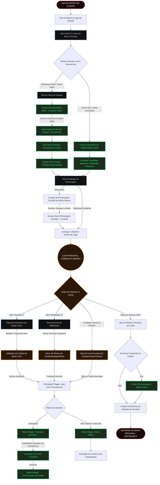

# 🛡️ DANGER GHOST — DIABLO UI/UX BLUEPRINT & COMPONENT GUIDE
## 🏛️ Diretrizes de Design de Interface Gótica e Sincronização Web3 DeSo

**Autor:** Diretor de Arte de UI/UX & Game Feel (Senior Game UI/UX Director)  
**Versão:** 1.0.0-GOTHIC-DESO  
**Projeto:** Danger Ghost (RPG de Ação Gótico / Web3)  
**Data:** 1 de Junho de 2026  

---

> [!NOTE]
> Este documento técnico serve como o guia mestre de implementação de UI/UX para a equipe de desenvolvimento full-stack e game dev de **Danger Ghost**. Ele une o peso estético e tátil dos RPGs góticos clássicos do final dos anos 90 (*Diablo II*) com a transparência operacional e fricção zero do ecossistema de carteiras descentralizadas da blockchain **DeSo**.

---

## 🧭 1. ÁRVORE DE FLUXO DE USUÁRIO (USER FLOW TREE)

O fluxo de usuário de *Danger Ghost* foi desenhado para eliminar a barreira convencional de onboarding Web3 ("Web3 fatigue"), fundindo a criação e autorização de chaves criptográficas diretamente na imersão e narrativa de fantasia sombria do jogo.

### 1.1 O Pacto de Sangue: Integração Sem Fricção da Carteira DeSo
Em vez de interromper o jogador com pop-ups de extensão de navegador a cada ação de combate ou salvamento de loot, utilizamos a tecnologia de **Derived Keys (Chaves Derivadas)** da blockchain DeSo.
*   **A Metáfora In-Game:** O login é apresentado como o *"Pacto de Sangue"* ou *"Pedra Rúnica da Alma"*. 
*   **Fluxo de Chave Derivada:** Durante a primeira inicialização, o jogador autoriza o jogo a assinar transações limitadas em seu nome (Derived Key temporária, com permissões exclusivas para a ação `SubmitPost` contendo o payload `DangerGhost_SaveState` no `PostExtraData`). Isso permite atualizações transparentes em segundo plano sem quebrar a ação do jogador.

### 1.2 Diagrama Completo de Fluxo (Mermaid Flowchart)



---

## ⚔️ 2. LAYOUT E WIREFRAMES DO HUD DE COMBATE GÓTICO

O HUD de combate de *Danger Ghost* é projetado para uma tela com proporção de **16:9** (Canvas Padrão: **1920x1080**), concentrando todas as informações vitais e botões de ação rápidos na borda inferior da tela, minimizando distrações visuais e maximizando a área de combate sombria.

### 2.1 Wireframe Textual do Canvas Completo (1920 x 1080)
Abaixo está o layout geométrico representado em coordenadas relativas de posicionamento de interface:

```
+----------------------------------------------------------------------------------------------------+
| [WALLET: BC1YL... ]                                                           [OPÇÕES / REDE: (O)] |
|                                                                                                    |
|                                                                                                    |
|                                                                                                    |
|                                                                                                    |
|                                                                                                    |
|                                                                                                    |
|                                                                                                    |
|                                                                                                    |
|                                                                                                    |
|                                                                                                    |
|                                                                                                    |
|                                                                                                    |
|                                                                                                    |
|                                                                                                    |
|                                                                                                    |
|                                                                                [MINIMAPA CIRCULAR] |
|                                                                                |   +-----------+  | |
|                                                                                |   |  Rúnico   |  | |
|                                                                                |   +-----------+  | |
|                                                                                | [WEB3 SYNC WIDGET]|
|                                                                                +-------------------+
|      +----------+   +--------------------------------------------------+   +----------+            |
|     /  VIDA     \   | XP ============================================= |  /   MANA     \           |
|    /  (GLOBO)    \  | [1]  [2]  [3]  [4]  [Q]  [W]  [E]  [R]  [M1]  [M2] | /   (GLOBO)    \          |
|    |  1500 HP    |  +--------------------------------------------------+ |   350 MP     |          |
|    \  (ESQUERDO) /  | [I] MOCHILA  [K] HABILIDADES  [C] PERFIL  [ESC] MENU|  \  (DIREITO)  /          |
|     +----------+    +--------------------------------------------------+   +----------+            |
+----------------------------------------------------------------------------------------------------+
```

### 2.2 Especificações de Componentes e Coordenadas do HUD

#### A. Globo de Vida (Esquerdo) — A Runa de Sangue
*   **Posicionamento no Canvas:** `left: 20px`, `bottom: 15px`.
*   **Dimensões:** `160px` de diâmetro (Círculo Perfeito).
*   **Estilo Visual:** Envolto por uma moldura rústica de ferro gótico fundido com uma gárgula de pedra segurando a base do globo. A vida é representada por um líquido viscoso vermelho rubi espesso.
*   **Comportamento Dinâmico:** 
    *   Um shader de fluido dinâmico simula ondulações suaves.
    *   *Alerta de Sangue:* Quando a vida cai abaixo de $30\%$, a borda metálica pulsa em vermelho escarlate ardente com um filtro de vinheta nas bordas da tela.
    *   Um pequeno indicador numérico centralizado exibe `HP: 1500 / 1500` com a fonte gótica medieval personalizada.

#### B. Globo de Recursos (Direito) — A Runa de Mana
*   **Posicionamento no Canvas:** `right: 20px`, `bottom: 15px`.
*   **Dimensões:** `160px` de diâmetro.
*   **Estilo Visual:** Envolto por um anjo decaído de asas de ferro com entalhes rúnicos que brilham levemente. O fluido interno é de cor roxo-espectral/azul-cobalto translúcido, representando a energia arcana.
*   **Comportamento Dinâmico:**
    *   O consumo de recursos faz com que o nível do fluido baixe instantaneamente, revelando um fundo de vidro fosco cinza-cinza.
    *   Quando a mana está esgotada, sussurros espectrais visuais piscam no contorno do globo, indicando falta de mana para a habilidade tentada.

#### C. Hotbar Central (Barra de Ações e Atalhos)
*   **Posicionamento no Canvas:** `left: 50%`, `bottom: 15px`, `transform: translateX(-50%)`.
*   **Dimensões:** `760px` de largura por `95px` de altura.
*   **Composição Física:**
    *   **Barra de Experiência (XP):** Uma linha dourada de apenas `4px` de altura estendendo-se por toda a largura superior da Hotbar.
    *   **Hotkeys de Habilidade (Slots 1 a 4 & Q, W, E, R):** Quadrados de `56px x 56px` com bordas rústicas de bronze envelhecido. Cada slot mostra a tecla mapeada em dourado brilhante no canto superior esquerdo e um contador digital de cooldown com efeito visual de varredura circular de relógio de sombra.
    *   **M1 & M2 (Mouse Left/Right Click):** Slots ligeiramente maiores (`64px x 64px`) nas extremidades da área de habilidades. M1 é a habilidade básica determinada, M2 é a habilidade secundária ativa.
    *   **Botões de Menu Rápido:** Pequenos botões retangulares (`110px x 24px`) posicionados na base da Hotbar para acesso imediato via mouse: `[I] Mochila`, `[K] Habilidades`, `[C] Perfil`, `[ESC] Menu`.

#### D. Minimapa & Wallet Widget (Canto Superior Direito)
*   **Posicionamento no Canvas:** `right: 20px`, `top: 20px`.
*   **Dimensões:** `200px` de largura por `250px` de altura máxima.
*   **Estilo Visual:** Um minimapa circular clássico de radar cercado por um compasso de latão e entalhes nórdicos. Directamente abaixo deste minimapa está acoplado o **Web3 Sync & Wallet Widget**, exibindo o status de gravação de progresso em tempo real do blockchain DeSo.

---

## 🎒 3. PAINEL DE INVENTÁRIO EM GRADE (GRID INVENTORY) E ÁRVORES DE HABILIDADES

A manipulação de itens e a progressão em *Danger Ghost* requerem fidelidade física e clareza visual geométrica. O painel é ativado ao pressionar a tecla `I`, dividindo a tela ao meio em um painel semi-translúcido no lado direito, enquanto a jogabilidade é mantida no esquerdo.

### 3.1 Painel de Equipamento e Mochila Ativa (Grid Layout)

O painel de inventário possui exatamente duas subseções físicas: o **Painel do Personagem (Boneco do Equipamento)** na parte superior e a **Mochila em Grade (Matriz 10x4)** na parte inferior.

```
+-------------------------------------------------------------+
|                [X] FECHAR INVENTÁRIO (I)                    |
+-------------------------------------------------------------+
|                                                             |
|                       +-------------+                       |
|                       |    HEAD     | <--- ELMO (2x2)       |
|                       |   [x0, y0]  |                       |
|                       +-------------+                       |
|        +---------+    +-------------+    +---------+        |
|        | L. HAND |    |    CHEST    |    | R. HAND |        |
|        | (1x3)   |    |   (2x3)     |    | (2x3)   |        |
|        | [x2, y0]|    |   [x0, y2]  |    | [x3, y0]|        |
|        +---------+    +-------------+    +---------+        |
|                       +-------------+                       |
|                       |   AMULET    | <--- AMULETO (1x1)    |
|                       |   [x0, y5]  |                       |
|                       +-------------+                       |
|                +-------+           +-------+                |
|                | RING1 |           | RING2 | <--- ANÉIS     |
|                | (1x1) |           | (1x1) |      (1x1)     |
|                +-------+           +-------+                |
|                                                             |
+-------------------------------------------------------------+
| MOCHILA ATIVA DE AVENTURA (GRADE 10 x 4 SLOTS - 40px/Célula) |
+-------------------------------------------------------------+
| [ ][ ][ ][ ][ ][ ][ ][ ][ ][ ] (y=0)                        |
| [ ][ ][ ][ ][ ][ ][ ][ ][ ][ ] (y=1)                        |
| [ ][ ][ ][ ][ ][ ][ ][ ][ ][ ] (y=2)                        |
| [ ][ ][ ][ ][ ][ ][ ][ ][ ][ ] (y=3)                        |
|  0  1  2  3  4  5  6  7  8  9  (x)                          |
+-------------------------------------------------------------+
```

#### Regras Geométricas do Inventário de Grade:
1.  **Grade de Colisão Lógica:** Cada slot da mochila é uma célula quadrada de `40px x 40px` com espaçamento de `2px` (gap).
2.  **Dimensões Físicas dos Itens Dropados:**
    *   *Anéis, Amuletos e Gemas:* `1x1` slot.
    *   *Elmos e Luvas:* `2x2` slots.
    *   *Espadas Curtas, Adagas:* `1x3` slots.
    *   *Armaduras de Peito, Escudos e Espadas Duas Mãos:* `2x3` ou `2x4` slots.
3.  **Mapeamento de Coordenadas de Equipamento Ativo:**
    *   `HEAD` (Elmo): Ocupa a posição lógica centralizada com área `2x2`.
    *   `CHEST` (Peitoral): Posicionado abaixo do elmo, área `2x2` ou `2x3`.
    *   `L. HAND / R. HAND` (Armas e Escudos): Flanqueiam o peitoral.
    *   `RING1 / RING2` e `AMULET`: Alinhados abaixo do peitoral para joalharia.

---

### 3.2 Estrutura da Árvore de Habilidades (Skill Trees)

A progressão mística do Danger Ghost baseia-se em 3 ramos de habilidade especializados: **Caminho da Sombra** (Evasão e Velocidade), **Caminho do Sangue** (Dano focado em sacrifício de HP) e **Caminho da Morte** (Drenagem de Almas e Veneno). Pressione a tecla `K` para abrir a árvore.

```
                    [ TELA DE PROGRESSÃO RÚNICA ]
     +---------------------------------------------------------+
     | [ CAMINHO DA SOMBRA ]  [ CAMINHO SANGUE ]  [ C. MORTE ] |
     +---------------------------------------------------------+
     |                                                         |
     |                     ( TIER 1: BASE )                    |
     |                     [ GHOST WALK ] (0/5)                |
     |                            |                            |
     |             +--------------+--------------+             |
     |             v                             v             |
     |     ( TIER 2: MOBILIDADE )      ( TIER 2: PROTEÇÃO )    |
     |     [ SHADOW STEP ] (0/3)       [ VOID SHIELD ] (0/5)   |
     |             |                             |             |
     |             +--------------+--------------+             |
     |                            v                            |
     |                    ( TIER 3: ULTIMATE )                 |
     |                    [ SPECTER STRIKE ] (0/1)             |
     |                                                         |
     +---------------------------------------------------------+
     | PONTOS DISPONÍVEIS: [ 5 ]             [ RESETAR PONTOS ]|
     +---------------------------------------------------------+
```

#### Detalhes Visuais e Comportamentais das Habilidades:
*   **Linhas Conectoras:** Conectores dourados brilhantes indicam caminhos desbloqueados. Linhas cinzas apagadas representam ramos travados (requisitos de nível ou pontos anteriores não atendidos).
*   **Indicador de Progresso do Nó:** O nó ativado exibe uma moldura rúnica brilhante com a contagem atualizada (ex: `(3/5)`). Ao alcançar a pontuação máxima `(5/5)`, o contorno adquire um tom de ouro ardente e a runa emite pequenas partículas de luz dinâmicas.

---

## 🔗 4. WEB3 SYNC NOTIFICATIONS & STATUS INDICATOR

O **Web3 Sync Widget** é o coração da transparência e integridade da blockchain DeSo in-game. Ele fica acoplado logo abaixo do minimapa, informando o jogador sobre cada salvamento em segundo plano sem quebrar o gamefeel gótico.

### 4.1 Estados do Widget e Especificações de Estilo

```
+--------------------------+
|  BC1YL...   [🔑 DERIVED] | <--- Endereço Público e Estado da Derived Key
|  ● SINCRONIZADO          | <--- Estado Ativo (Verde Rúnico / Pulso Estável)
+--------------------------+
```

| Estado da Sincronização | Cor Principal (Hex) | Efeito de Animação | Descrição Visual e Gatilhos |
| :--- | :--- | :--- | :--- |
| **Sincronizado** | `#00FF88` (Verde Esmeralda) | Pulsar Lento (`ruricGlow`) | **Salvamento Seguro:** Indica que o save state local está em perfeito sincronismo com a blockchain DeSo. O ponto pulsa suavemente a cada 4 segundos. |
| **Salvando na DeSo...** | `#FF8800` (Laranja Alquímico) | Rotação / Oscilação (`forgePulse`) | **Envio em Progresso:** Disparado em auto-saves (fim de inventário, nível ganho, elites derrotados). Uma animação de engrenagem rúnica gira em torno do status de conexão. |
| **Modo Offline** | `#888888` / `#FF3333` (Vermelho Sangue Seco)| Piscamento Rápido (`fadeBlink`) | **Falta de Rede:** Exibido se a conexão com o nó DeSo falhar. O jogo avisa que o progresso está sendo mantido temporariamente no cache criptografado local. |

---

### 4.2 Código CSS e Micro-interações do Widget

Para a implementação na interface web-app de *Danger Ghost*, o designer de interface especifica as seguintes classes estilizadas e animações chave:

```css
/* Container Principal do Widget */
.deso-sync-widget {
  font-family: 'Alagard', 'Courier New', monospace; /* Fonte Gótica Pixel */
  background: rgba(12, 10, 10, 0.85);
  border: 2px solid #3c2a21;
  border-radius: 4px;
  padding: 8px 12px;
  width: 190px;
  box-shadow: 0 0 10px rgba(0, 0, 0, 0.9), inset 0 0 5px rgba(100, 60, 40, 0.2);
  color: #d2c4b1;
  font-size: 11px;
  transition: all 0.3s cubic-bezier(0.25, 0.8, 0.25, 1);
  letter-spacing: 0.5px;
}

/* Informações da Carteira */
.wallet-address {
  font-size: 10px;
  color: #8c7e6c;
  display: flex;
  justify-content: space-between;
  margin-bottom: 4px;
  border-bottom: 1px dashed #3c2a21;
  padding-bottom: 4px;
}

.derived-key-badge {
  color: #ff8c00;
  font-size: 9px;
  text-shadow: 0 0 4px rgba(255, 140, 0, 0.5);
}

/* Status do Indicador de Conexão */
.status-indicator {
  display: flex;
  align-items: center;
  gap: 6px;
  font-weight: bold;
}

.status-dot {
  width: 8px;
  height: 8px;
  border-radius: 50%;
  display: inline-block;
  box-shadow: 0 0 6px currentcolor;
}

/* ESTADO 1: SINCRONIZADO */
.state-synchronized {
  color: #00ff88;
}
.state-synchronized .status-dot {
  background-color: #00ff88;
  animation: ruricGlow 4s infinite ease-in-out;
}

/* ESTADO 2: SALVANDO NA DESO */
.state-saving {
  color: #ff8800;
}
.state-saving .status-dot {
  background-color: #ff8800;
  animation: forgePulse 1.2s infinite ease-in-out;
}

/* ESTADO 3: OFFLINE */
.state-offline {
  color: #ff3333;
}
.state-offline .status-dot {
  background-color: #ff3333;
  animation: fadeBlink 1.5s infinite steps(2, start);
}

/* --- KEYFRAMES DE ANIMAÇÕES --- */

/* Brilho Lento - Runic Glow */
@keyframes ruricGlow {
  0%, 100% {
    transform: scale(1);
    filter: drop-shadow(0 0 2px rgba(0, 255, 136, 0.4));
    opacity: 0.8;
  }
  50% {
    transform: scale(1.15);
    filter: drop-shadow(0 0 8px rgba(0, 255, 136, 1));
    opacity: 1;
  }
}

/* Pulsação Alquímica Forte - Forge Pulse (Simula o calor do salvamento on-chain) */
@keyframes forgePulse {
  0%, 100% {
    transform: scale(1);
    filter: drop-shadow(0 0 2px rgba(255, 136, 0, 0.5));
    opacity: 0.9;
  }
  50% {
    transform: scale(1.3);
    filter: drop-shadow(0 0 10px rgba(255, 136, 0, 1));
    opacity: 1;
    background-color: #ffd000; /* Núcleo fica dourado no pico */
  }
}

/* Piscamento de Emergência - Fade Blink */
@keyframes fadeBlink {
  to {
    visibility: hidden;
    filter: drop-shadow(0 0 0px transparent);
  }
}
```

### 4.3 Micro-interações e Sound Design do Widget (SFX)

A experiência de confirmação de que os dados estão salvos na blockchain permanente precisa dar ao jogador a sensação tátil de "conquista e peso eterno". Propomos os seguintes gatilhos sensoriais complementares à interface visual:

1.  **Gatilho de Entrada (Salvando...)**:
    *   *Visual:* A borda do widget `deso-sync-widget` emite uma linha de varredura horizontal de luz laranja brilhante de cima para baixo.
    *   *Áudio (SFX):* Som mecânico de baixa frequência, lembrando engrenagens de bronze lubrificadas e o bater distante de um martelo em uma bigorna de ferreiro de masmorra (*"Heavy Forge Strike"*).
2.  **Confirmação de Sucesso (Sincronizado)**:
    *   *Visual:* O widget brilha intensamente em verde esmeralda por `300ms`, liberando uma pequena nuvem de partículas rúnicas circulares na tela que decaem por gravidade simulada.
    *   *Áudio (SFX):* Um som metálico cristalino, levemente reverberado, que evoca um sino sagrado ou o trancamento pesado de um cofre antigo de runas (*"Stone Seal Chime"*).
3.  **Alerta de Modo Offline / Perda de Rede**:
    *   *Visual:* O widget treme levemente de forma horizontal por `200ms` (efeito de impacto de tela ou screen-shake de UI) e muda sua coloração para cinza fosco com o ponto em vermelho-sangue piscante.
    *   *Áudio (SFX):* Som abafado e cavernoso, similar ao fechar de uma grade de ferro pesada em uma masmorra úmida (*"Dungeon Gate Slam"*).

---

### 🛡️ Considerações Finais do Diretor de UI/UX
Esta arquitetura visual foi projetada para honrar a nostalgia tátil e estética de RPGs sombrios imortais, mantendo as demandas contemporâneas de usabilidade da Web3. A fricção reduzida pelas **Derived Keys** combinada com a expressividade sensorial dos estados de sincronização garante que a experiência de salvamento on-chain da blockchain DeSo se sinta menos como uma burocracia de criptomoedas e mais como um ritual místico de selamento de alma dentro do universo perigoso de **Danger Ghost**.
