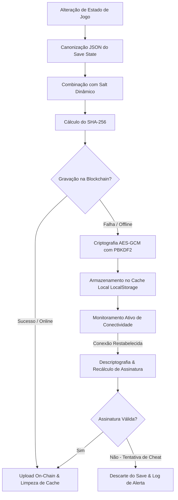

# 🛡️ Relatório Arquitetural de Segurança, Resiliência e Políticas Anti-Cheat
## Ecossistema DragaMP — Módulo de Persistência Segura DeSo (Danger Ghost)

---

## 🏛️ 1. Introdução: A Visão de Segurança AAA em Jogos Web3
No desenvolvimento de RPGs de Ação modernos com economia on-chain e persistência descentralizada (como o **Danger Ghost** integrado à blockchain **DeSo**), a segurança do lado do cliente é um dos maiores desafios. Ambientes de execução abertos (como navegadores web com console F12 aberto e acesso direto à memória) tornam o estado local do jogo vulnerável a manipulações de valores (Gold, Level, XP, atributos de itens).

Se um jogador puder injetar dados arbitrários em memória e enviá-los diretamente para a blockchain através da sua chave derivada, toda a integridade econômica e competitiva do jogo desmorona. 

Para anular essa ameaça, este módulo estabelece duas camadas de defesa intransponíveis:
1. **Assinaturas Dinâmicas de Integridade (SHA-256 com Salts Compostos)** no cliente, validadas pelo servidor.
2. **Buffer Local Criptografado de Alta Resiliência (Fail-Safe AES-GCM + PBKDF2)** para tolerância a falhas de rede severas sem quebra de gamefeel.

---

## ⚔️ 2. Assinaturas de Integridade Baseadas em SHA-256 e Salt Dinâmico

A primeira barreira de segurança reside no processo de assinatura criptográfica que ocorre no momento de cada checkpoint de salvamento.

### 2.1 O Problema da Serialização JSON Tradicional
Em JavaScript/TypeScript, a ordenação de chaves ao executar `JSON.stringify(objeto)` não é determinística. Duas instâncias idênticas de um save state com chaves declaradas em ordens diferentes geram strings JSON distintas e, consequentemente, hashes SHA-256 totalmente diferentes.
*   **Solução Implementada:** O método `canonicalize` da classe `IntegritySigner` realiza uma ordenação lexicográfica recursiva de todas as chaves do objeto de estado antes de computar o hash. Isso garante que o input do SHA-256 seja **100% determinístico e consistente**.

### 2.2 Anatomia do Salt Dinâmico Composto
Utilizar uma string estática (salt estático) hardcoded no cliente torna o jogo vulnerável a ataques de engenharia reversa simples: um atacante descobre o salt lendo os arquivos fonte do frontend e reconstrói o gerador de assinaturas localmente.
Para evitar isso, criamos o **Salt Dinâmico Composto** via `generateDynamicSalt`, que combina:
$$\text{Salt} = \text{CarteiraCliente} + \text{UltimoHashDeBlocoDeSo} + \text{SessionNonce}$$

*   **Carteira do Cliente:** Vincula a assinatura unicamente ao proprietário do save, impedindo ataques de replay de save states entre contas diferentes.
*   **Último Hash de Bloco DeSo (Server/Blockchain Seed):** Um fator mutável em tempo real obtido diretamente da rede blockchain. Isso cria uma barreira contra o congelamento de dados. Mesmo se um atacante copiar um save state assinado e tentar reinjetá-lo horas depois, a transação será rejeitada, pois o salt baseado no hash do último bloco já expirou.
*   **Session Nonce:** Um valor de entropia aleatória gerado na inicialização da sessão de jogo pelo servidor de oráculos.

### 2.3 Fluxo de Assinatura e Validação
1. **Assinatura:** O estado de jogo é convertido em formato canônico, concatenado ao Salt Dinâmico Composto e hashificado em SHA-256. O envelope resultante contém os dados, o salt e o hash.
2. **Validação Cruzada (Server-Side):** Ao receber a transação contendo o save state compactado, o oráculo de validação executa a mesma lógica em ambiente seguro (servidor), recalculando o hash com base no salt ativo da sessão e rejeitando instantaneamente qualquer transação em que as assinaturas divirjam.

---

## 🔒 3. Mecanismo Fail-Safe Criptográfico Local (AES-GCM + PBKDF2)

A infraestrutura Web3 descentralizada está sujeita a picos de latência e quedas temporárias de nós RPC. Um jogo AAA não pode interromper a experiência do jogador com pop-ups de erro de gravação a cada oscilação de internet. A solução é a **Política Fail-Safe Criptográfica Local**.

### 3.1 Criptografia Autenticada (AES-GCM)
Armazenar o save state localmente em texto puro no `localStorage` durante uma queda de internet seria um convite para cheats de alteração de arquivo.
*   **Decisão de Design:** Adotamos o algoritmo **AES-GCM (Advanced Encryption Standard - Galois/Counter Mode)** com chaves de 256 bits através da Web Crypto API nativa do navegador.
*   **Segurança Autenticada:** O modo GCM fornece confidencialidade (ninguém consegue ler o save) e **autenticidade/integridade** (qualquer tentativa de alterar sequer 1 bit do arquivo criptografado corrompe a tag de autenticação GCM, disparando um erro fatal de decifragem que invalida o save modificado).

### 3.2 Derivação de Chaves Resiliente (PBKDF2)
Para evitar o uso de chaves simétricas estáticas, a chave AES é derivada dinamicamente através do algoritmo **PBKDF2 (Password-Based Key Derivation Function 2)**:
*   Aplica **100.000 iterações** de hash SHA-256.
*   Utiliza um **Salt Criptográfico Aleatório de 16 bytes** gerado por `crypto.getRandomValues()`.
*   O Vetor de Inicialização (IV) de 12 bytes é único para cada salvamento individual, prevenindo ataques criptográficos de dicionário ou análise de frequência de cifras repetidas.

---

## 🌐 4. Tratamento de Exceções de Rede e Sincronização Inteligente

O `FailSafeSyncManager` gerencia o ciclo de vida operacional da conexão.

### 4.1 Tratamento e Captura de Exceções (Network Exceptions)
Qualquer requisição HTTP para nós DeSo (ex: `submit-post`) ou gateways de validação de rede pode falhar por diversos motivos:
*   `TypeError: Failed to fetch` (Queda de conexão local).
*   `Timeout` (Nó blockchain sobrecarregado).
*   `HTTP 502 / 503 / 504` (Queda de servidores intermediários).

O sistema captura de forma genérica e robusta todas essas exceções dentro do método `saveState()`. Quando capturado:
1. O fluxo de salvamento em nuvem é interrompido temporariamente.
2. O estado atual é assinado e criptografado com AES-GCM.
3. É persistido no armazenamento físico do dispositivo (`localStorage`).
4. Retorna uma resposta amigável ao motor do jogo: `{ success: true, target: 'local_cache' }`. O jogo continua a rodar sem lentidão, exibindo um feedback sutil de "Progresso salvo localmente".

### 4.2 O Loop de Heartbeat e Monitoramento de Conexão
Uma vez ativado o estado offline, o `FailSafeSyncManager` inicia um monitor inteligente de conectividade:
*   **Listeners Nativos:** Registra o evento `online` do navegador para agir de forma instantânea assim que o hardware detectar rede.
*   **Batimento Cardíaco Ativo (Active Heartbeat):** Dispara requisições periódicas super-leves (ping no endpoint `/get-app-state` com timeout de 3 segundos) para o nó blockchain. Isso garante que a internet esteja de fato trafegando pacotes estáveis antes de disparar o upload, evitando falhas parciais e consumo desnecessário de processamento do cliente.

### 4.3 Sincronização Segura e Determinística (Auto-Sync)
Ao restabelecer a estabilidade de rede, o gerenciador:
1. Recupera o envelope criptografado do armazenamento local.
2. Descriptografa os dados utilizando a chave AES derivada pelo segredo local.
3. **Verificação de Segurança pós-offline:** Recalcula a assinatura SHA-256 original gerada no momento exato do checkpoint de jogo. Se o jogador tiver tentado alterar os bytes criptografados no arquivo físico do navegador ou se a integridade falhar por qualquer outro motivo, o buffer é descartado imediatamente, impedindo a injeção retroativa de dados burlados.
4. Efetua a transação on-chain DeSo com sucesso.
5. Limpa a área de cache físico offline.

---

## 🛑 5. Diretrizes da Política Anti-Cheat e Mitigação de Vetores de Ataque

| Vetor de Ataque | Mecanismo de Exploração | Contra-medida Implementada | Efeito Prático |
| :--- | :--- | :--- | :--- |
| **Manipulação de Memória Local** | Alteração de valores de Gold ou Atributos via Console F12 em tempo de execução. | **Assinaturas SHA-256 Determinísticas e Salts Dinâmicos.** | Qualquer mudança em memória dessincroniza o estado em relação à assinatura no upload, resultando em rejeição instantânea da transação. |
| **Ataque de Replay (Replay Attack)** | Captura de uma transação legítima de save e reinjeção repetida em blocos futuros para duplicar recompensas. | **Salts baseados no último hash de bloco DeSo e verificação de Timestamps.** | O salt expira em poucos minutos. Transações antigas geram assinaturas inválidas contra os blocos recentes da rede. |
| **Adulteração de Save Offline** | Modificação dos dados salvos localmente em cache durante o período em que o cliente ficou offline. | **Criptografia AES-GCM Autenticada e PBKDF2.** | Qualquer alteração de dados offline invalida a tag GCM, impedindo a descriptografia do save e descartando-o por quebra de integridade. |
| **Ataque Sybil de Saves Cruzados** | Copiar o arquivo de save assinado de um jogador de nível alto e injetar na conta de um jogador nível 1. | **Salt contendo o endereço da carteira pública do jogador.** | A assinatura só é válida se computada com a carteira de origem do jogador conectado, inviabilizando o roubo de saves. |
| **Oráculo de Simulação Lógica** | Jogador envia um save assinado matematicamente correto, mas com progressão absurda (ex: pulou do nível 1 para o 50). | **Oráculo de Simulação (Server-Side/Oracle Validation).** | O servidor recria e valida as fórmulas de XP, iLvl de drops e mLvl do plano arquitetural. Se houver discrepância física, o save é banido. |

---

## 💎 6. Conclusão: UX Impecável aliada a Segurança Criptográfica

Com essa arquitetura híbrida de salvamento seguro, o **Danger Ghost** atinge o padrão de excelência de jogos AAA. O jogador desfruta de uma experiência de combate gótico imersiva com latência zero e salvamentos transparentes graças às chaves derivadas (Derived Keys) DeSo. 

Simultaneamente, falhas pontuais de internet e flutuações de nós da blockchain deixam de ser uma fonte de frustração, sendo contornadas silenciosamente por criptografia autenticada local. O ecossistema DragaMP se posiciona, dessa forma, na vanguarda da segurança e usabilidade técnica na Web3.
