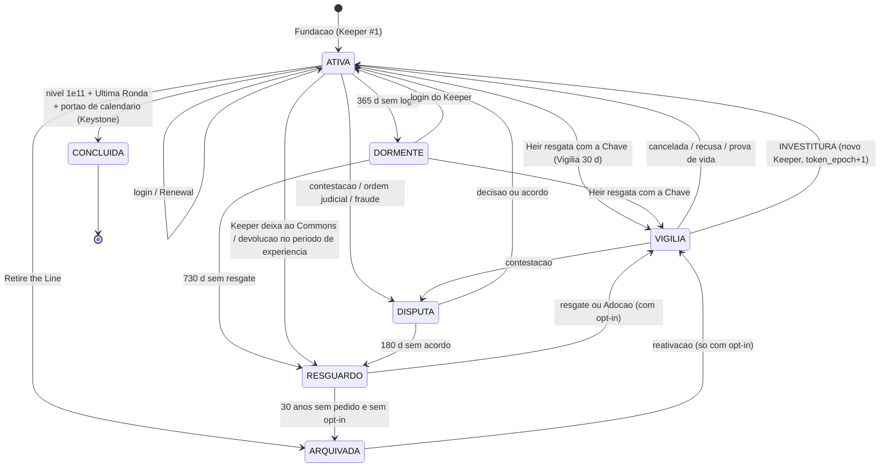

# 03 — Sucessão, Crônica e o Fim do Jogo ("zerar")

Autor: `legacy-systems-designer` · Data: 2026-09-20 · Versão 2 (alinhada a `01_filosofia`, `04_durabilidade`, `05_integridade_antiabuso` e `09_arquitetura_migracao`) · Modo: **PLANO** (nenhum arquivo do jogo foi tocado; nenhuma consulta ao banco de produção)
Escopo: gaps **4** (sucessão), **6** (parte de sucessão e fim do jogo) e **10** (ranking por geração, ghosts secundários); contribuições para **5, 9 e 11**.

> **Aviso obrigatório (skill `digital-succession-compliance`):** este documento é um mapeamento de design e risco, **não é aconselhamento jurídico**. Nada aqui substitui um advogado inscrito na OAB (de preferência com experiência em direito digital/LGPD e sucessões). O dono precisa que um profissional habilitado valide toda conclusão jurídica, os Termos de Uso, a Política de Privacidade e qualquer estrutura de fundação antes do lançamento. Textos de tela e de contrato aqui são rascunhos de produto.

Legenda: **[VERIFICADO]** = li no código/doc (arquivo citado) ou conferi por cálculo; **[CÁLCULO]** = conta em Node (scripts `succession_calc.js` e `chronicle_events_calc.js`, só no scratchpad); **[HIPÓTESE]** = proposta minha ou estimativa.

---

## (a) Resumo em 10 linhas

1. **Unidade do legado = a Linha (Line).** Cada conta é uma Linha própria, com régua individual (~409.000 h ativas) começando no nível 1 — idêntico a `09` D-3 e `01` D10. A "conta única do mundo" vira só um **Hall dos Guardiões** que agrega as Linhas (§4.2).
2. **Um Guardião (Keeper) por vez.** A Passagem (Handover) tem uma **Vigília de 30 dias** *antes* de o controle mudar, em que o Guardião de saída segue no comando e o Herdeiro (Heir) só observa. Depois da Investidura há 30 dias de **período de experiência**, com devolução sem custo.
3. **Nenhuma senha viaja.** Três fatores (`05` §4.5): a **Chave do Legado** em papel + o Herdeiro autenticado + a Vigília. Na Investidura o sistema troca a senha, sobe `token_epoch` e derruba todas as sessões web e mobile.
4. **Sete estados:** Ativa, Dormente, Vigília, Resguardo, Disputa, Concluída (Keystone), Arquivada. "Conta reclamada" é um *tipo de Passagem*, não um estado.
5. **Só três caminhos** para trocar de Guardião (`05` §4.4): Ritual, Cofre (Chave do Legado) ou ordem judicial. Concedi a `05` e retirei da minha v1 a "revisão humana de parentes" e o "reconhecimento no login".
6. **Adoção só com consentimento prévio** do Guardião (Commons opt-in, `01` caso 3). Sem ele, a Linha termina em Monumento, nunca é dada a um estranho.
7. **Crônica em duas camadas:** fatos (sem dado pessoal, para sempre) e identidade (apelido, cartas — com consentimento, apagável). A cadeia de hash guarda **números de geração, nunca nomes**, para sobreviver ao apagamento.
8. **Herdeiro que nunca jogou:** Vestíbulo (leitura, sem poder), recusa sem custo, e "primeiro dia" com um **Ghost Aprendiz** (multi-personagem já existe) enquanto o Legacy Ghost "repousa".
9. **Zerar é da Linha, não de uma pessoa nem do mundo:** a **Keystone** (pedra angular) honra a cadeia inteira; Monumento imutável; "Novo Ciclo" é Linha nova; empate no mesmo ano = **Keystone conjunta**.
10. **Achados que cruzam relatórios:** (i) `09` cria um índice único de "um Guardião ativo" mas o fluxo dele insere o novo Guardião **antes** de encerrar o anterior — **viola o próprio índice** (DIV-1b); (ii) `09` F0 não inclui e-mail transacional/verificação, sem o qual a escada de avisos é letra morta (P0-1); (iii) a régua "1 h/dia" supõe **zero dias perdidos**: com 95% dos dias jogados a chegada vai de 3147 para **3207** [CÁLCULO].

---

## (b) Proposta detalhada

### A. Casamento com `01`, `04`, `05` e `09` (leia antes do resto)

#### A.1 Vocabulário final (de `01` §B.3) e onde eu mudei minha v1

Os termos oficiais do jogo são em **inglês** (o jogo é EN); uso o PT-BR para conversar e o EN entre parênteses. Regra de `01`: **nenhum termo pode ser palavra sagrada de tradição viva**.

| Meu termo v1 | Termo final (EN / PT-BR) | Observação / armadilha de tradução |
|---|---|---|
| Guardião / Herdeiro | **Keeper / Heir** (Guardião / Herdeiro) | Herdeiro **nomeado** = *Heir*; quem assume vindo do Commons = **Successor** (Sucessor) |
| Conta = Linhagem | **the Line** / a Linha (rótulo social opcional: *House*) | "Linhagem" segue como sinônimo em PT |
| Crônica / Livro do Legado | **the Chronicle** / a Crônica; cada registro = **an Entry** | evitar `Ledger` |
| Ghost do Legado | **the Legacy Ghost** | evitar `Heirloom` |
| Passagem | **the Handover** / a Passagem | **nunca `the Passing`** (= falecimento) |
| Investidura | **the Investiture** | evitar `Oath` (cria obrigação, viola o Princípio 3) |
| Aceitar / recusar | **Accept the Charge / Decline the Charge**, com o **mesmo peso visual** | recusa registrada como *declined*, tom neutro |
| Carta de Sucessão (o formulário) | **Designação de Herdeiro** (*Heir Designation*) | reservei "Carta" para a mensagem |
| Carta ao herdeiro; "Selos" do futuro | **the Sealed Letter** / a Carta Selada (com data opcional) | evitar `Testament`/`Will`. "Selo" some deste doc para mensagens |
| Selo de Sucessão (o segredo) | **Chave do Legado** (nome de `05`) guardada no **Cofre** (`succession_vault`, `09`) | "Selo" fica só para *Selo de Pioneiro* (`09`) e *Selo de Contestação* (`05`) |
| Custódia (estado órfão) | **Resguardo** (*Safekeeping*) | **nunca `Custodian`** (= zelador, EUA) |
| Custodiante | **Adulto Responsável** (*Responsible Adult*) | mesma armadilha de `Custodian` |
| Conta dormente | **Dormant** / Dormente | nunca `Abandoned` |
| Adoção | **Commons** (linhas abertas) + **Successor** | só com opt-in do Guardião |
| Devolver a chave | **Retire the Line** (encerra com honra) **ou** deixar ao Commons | duas coisas diferentes (§1.5) |
| Coroação / "Coroada" | **the Keystone** (a pedra angular); quem a coloca = **Keystone Bearer** | a coroa é da cadeia, não do último |
| Dia dos Guardiões | **the Roll Call** / a Chamada (leitura anual dos nomes) | evitar `Remembrance Day` (feriado militar) |
| "Chamada do Guardião" (`05`, prova de vida) | **Sinal do Guardião** (*Keeper's Signal*) | **colisão de nomes:** `05` e `01` usam "Chamada" para coisas diferentes; proponho renomear a de `05` |
| Renovação | **the Renewal** | também é o teste de integridade (Ise, `01` P7) |
| Contas de hoje | **Era Zero / the First Keepers** | |
| **Vigília** (espera antes da Investidura) | *Vigil* **[PROVISÓRIO]** | `01` listou "Vigil" como candidato **rejeitado para Renewal**, não para a espera; a filósofa confirma o uso |

#### A.2 Mapa de tabelas: minhas peças ↔ `09` (com o que precisa ser acrescentado)

| Meu conceito v1 | Tabela/coluna em `09` | O que eu **acrescento ou mudo** |
|---|---|---|
| Linha | `lineages` | `status` ganha `safekeeping` e `disputed` (§A.3 DIV-10); `commons_optin bool`; `trial_until`, `min_tenure_until`, `crown_pending_at`; `service_paused_until` |
| Mandato (fato) | `keepers` (generation, began_at, ended_at, end_reason, seconds_credited) | separo a **identidade** em `keeper_profiles` (DIV-12); acrescento `handoff_in_type`, `age_bracket`, `has_responsible_adult`, `custody_gap_seconds` |
| Designação + Passagem | `successions` (estados de `09`) | acrescento `kind` (`ritual`/`dormancy`/`adoption`/`judicial`/`majority`), `vigil_ends_at`, `heir_state`, `revision`; estado novo `reverted`; índice único parcial de `09` mantido |
| Cofre / Chave | `succession_vault` | `claim_token_hash` = Chave do Legado; `recovery_code_hashes` = 5 códigos de recuperação **do Guardião** (minha leitura, `backend-architect` confirma); `expires_at` **NULL** (a nomeação não "queima", `01` P5) |
| Cadeia de custódia + Crônica | `chronicle_events` (uma só cadeia) | mesclo meu `custody_log` **na mesma cadeia**; acrescento `visibility` (`public`/`house`/`private`) e regra "**sem dado pessoal no `payload`**" (DIV-9). O que é operacional e expira vai para `lineage_audit` (sem cadeia) |
| Relíquia | `relics` | `transferable` **default `false`** (DIV-13) |
| Horas ativas | `playtime_daily` / `lineages.total_seconds_credited` | só consumo; **não** uso `characters."time"` (teto 1e8 s) [VERIFICADO em `09` e no código] |
| Época de sessão | `players.token_epoch` (`09` §3.3) | a mesma coluna cobre a Passagem |
| Chave estável | `players.account_id` (`09` §1.0) | adoto; **retiro** minha proposta de "chave opaca `lineage_key`" |
| Fila de e-mails/desconexões | *(não existe em `09`)* | tabela `outbox` (§1.8, R5) |

#### A.3 Divergências explícitas (onde eu discordo, ou concedo)

| # | Quem disse o quê | O que eu decido | Por quê |
|---|---|---|---|
| **DIV-1** | `09` §3.2: ao resgatar, cria o novo Guardião na hora, sobe `token_epoch`, e "o Guardião anterior ainda pode cancelar" nos 30 dias. `05` §4.3: **espera de 30 dias antes**, com o Guardião no controle total. | **Sigo `05`**: a Vigília vem **antes** da mudança de controle; os 30 dias de `09` viram o **período de experiência** *depois* da Investidura. | Em `09`, `token_epoch++` no resgate derruba a sessão do Guardião de saída, que então **não consegue cancelar**. E um vazamento da Chave daria controle imediato de uma Linha viva. Mapeamento: `sealed` → (Herdeiro resgata) `pending_acceptance` = **Vigília** → Investidura → `transition` = **experiência** → `completed`. |
| **DIV-1b** | `09` §1.2 cria `ux_keepers_current` (só uma linha com `ended_at IS NULL`) **e** §3.2 insere `generation+1` deixando o anterior aberto até `completed`. | **Encerro o anterior na própria Investidura** (mesma transação); a janela de 30 d é *reversão para o Resguardo*, não "duas pessoas abertas". | O `INSERT` do novo Guardião **violaria o índice único parcial** (duas linhas abertas). Defeito de desenho, achado por leitura; teste em §7. |
| **DIV-2** | `09` D-1: o e-mail do fundador fica como login para sempre. `05` §4.2: separar pessoa (`users`) de Linha (`legacy_accounts`), o Herdeiro entra **com a própria conta**. Minha v1: trocar o e-mail de login. | **Passo 1 (MVP) = `09` D-1 "A′"**: e-mail do fundador segue como chave interna, **mais um `login_handle`** pseudônimo que substitui o e-mail na tela de login depois da 1ª Passagem; e-mails de recuperação vão só para `keepers.contact_email` do Guardião **atual**. **Passo 2 (later, antes da 1ª Passagem a não-familiar/Adoção) = modelo de `05`.** **Retiro** minha v1. | Em `09`-A puro, um **estranho por Adoção** teria de digitar o e-mail do fundador para entrar: vazamento de dado pessoal e canal de assédio; e, com "esqueci a senha" futuro, o fundador poderia retomar a Linha pelo e-mail. |
| **DIV-3** | `05` §4.3: o Guardião escolhe o Herdeiro entre **contas existentes**; aceite logado na conta do Herdeiro. | Aceito o **aceite autenticado**, mas permito **convite por e-mail** (o cônjuge/criança que nunca jogou precisa criar conta antes, com e-mail verificado). Herdeiro sem histórico/recém-criado = **sinal de RMT** (`05`), não bloqueio. | Escolher só entre contas existentes excluiria justamente o caso "nunca jogou". |
| **DIV-4** | `05` §4.4: só **3 caminhos**; "o operador não avalia laços familiares por e-mail". Minha v1: revisão humana de parentes (T3) e "reconhecimento no login". | **Concedo a `05`.** Documento de parentesco vira só o caminho 3 (**ordem judicial/instrumento legal**, via advogado). Removo "reconhecimento no login". Sem Chave e sem ordem: a Linha segue Dormente → Resguardo; a família pode pedir **memorial e exportação de dados** (LGPD, `digital-succession-counsel`). | Revisão humana é exatamente a superfície de engenharia social de um dev solo. Ofereço as opções (b)/(c) ao dono em D4, mas **não recomendo**. |
| **DIV-5** | `01` caso 3 / C4: adoção pelo Commons **só se o Guardião autorizou em vida**. Minha v1: adoção após 5 anos de Resguardo, sem consentimento. | **Concedo a `01`.** Adoção exige `commons_optin`; sem ele, a Linha vai a Monumento. | Consentimento nas duas pontas (C4) é condição de existir "legado". |
| **DIV-6** | `01` D8: recusa registrada como *declined*, neutra. Minha v1: "nada é retido". | **Adoto `01`**: evento `succession_declined`, **anônimo** (sem identidade do Herdeiro), tom neutro; o Guardião vê "declined". | Esconder do Guardião que o Herdeiro recusou é impossível (ele sabe quem convidou); melhor a frase honesta e sem culpa. |
| **DIV-7** | `01` F6/D11: herdeiro menor → Linha fica Dormente até ele poder aceitar, ou um responsável aceitar formalmente. | Compatível; **acrescento a Reserva**: enquanto houver menor designado com Adulto Responsável reconhecido, a **escada de dormência pausa**. | Sem isso a escada leva a Linha ao Resguardo antes de a criança crescer. |
| **DIV-8** | Números: `05` Sinal aos 180 d; `09` dormência aos 540 d, e-mails 365/450/520, janela 30 d; minha v1 365 d, Vigília 14 d. | Tabela única em §A.4. Dormente aos **365 d** (`09` propunha 540; ele mesmo diz "números meus, não decididos"); Vigília **30 d** (`05` e `09` convergem). | Um ano de silêncio já passou por 2 avisos. |
| **DIV-9** | `04` exemplo de Entry com `payload:{from:"Guardião anônimo #1"}`; `09` `payload JSONB` livre. | **`payload` só com números de geração, ids opacos e hashes de texto**; o apelido é resolvido **na leitura** a partir de `keeper_profiles`. Hash do texto usa **sal por texto**, apagado junto com o texto. | Se o apelido estivesse no `payload`, apagar a identidade (LGPD) **quebraria o hash** da cadeia. |
| **DIV-10** | `09` `lineages.status`: `active/dormant/in_succession/sealed/completed`. | Estendo com `safekeeping`, `disputed`. Leio `sealed` = **Arquivada** (Monumento) e `completed` = **Keystone**. | Faltavam Resguardo e Disputa. `backend-architect` confirma a leitura de `sealed`. |
| **DIV-11** | `05`: Chave de 24 palavras/256 bits, hash Argon2id ou bcrypt. `09`: token base64url de 256 bits, SHA-256. | **24 palavras (com checksum), 256 bits, guardada como SHA-256** (com 256 bits de entropia um hash rápido basta, argumento de `09`). `security-engineer` decide o desempate. | Palavras se copiam à mão sem erro; entropia alta dispensa hash lento. |
| **DIV-12** | `09` `keepers.display_name NOT NULL` ("nome público") e `contact_email` na mesma tabela. | Separo **fatos** (`keepers`) de **identidade** (`keeper_profiles`: apelido, epitáfio, consentimentos, `erased_at`) e de **contato** (`keeper_contacts`, apagável). Mantenho `contact_email_hash` de `09`. | Permite apagar a pessoa sem tocar nos fatos. |
| **DIV-13** | `09` `relics.transferable DEFAULT true`. | `DEFAULT false` (relíquia é honorífica, sem poder). | Relíquia transferível é um "item negociável", o oposto do anti-RMT. |
| **DIV-14** | `04` §2.2: em N2 (somente leitura) **congelam todos os relógios de `03`** e registra `service_paused`. | **Adoto:** todo prazo abaixo pausa (`service_paused_until`). | Ninguém cai em Dormente porque o servidor parou. |
| **DIV-15** | `05` D7(b): MFA (TOTP) obrigatório para Guardião **a partir da 1ª sucessão**. | **Adoto:** a Investidura inclui configurar MFA e guardar os códigos no envelope de papel. | |
| **DIV-16** | `05` §4.7: e-mail é canal de aviso, **nunca prova de posse**. | **Adoto:** o Sinal do Guardião só se completa **dentro do jogo** (login autenticado); clicar em e-mail **não** conta como prova de vida. | Domínios expiram e são recomprados. |
| **DIV-17** | Contagem de FKs: `09` diz 8 tabelas, `05` diz 5, minha v1 disse 7. | Recontei em `server/db.js`: **6 tabelas / 7 colunas** dependem de `players(email)` (`characters`, `diary_entries`, `egregora_messages`, `friendships` ×2, `player_badges`, `player_stat_progress`), todas `ON DELETE CASCADE` sem `ON UPDATE`. [VERIFICADO] | Não muda a conclusão; `backend-architect` confere. |

#### A.4 Parâmetros finais (ficam no servidor, **camada lenta/Bedrock**: só mudam por Amendment numerada, com plano de reversão — `01` P4/P6)

| Parâmetro | Valor | Origem |
|---|---|---|
| Sinal do Guardião (aviso dentro do jogo) | **180 d** sem login | `05` |
| Aviso informativo ao Herdeiro e ao Curador | **270 d** | meu |
| **Dormente** (o Herdeiro pode resgatar com a Chave) | **365 d** | meu (`09`: 540) |
| E-mails da escada | **365, 455, 545 d** | `09` (365/450/520) ajustado |
| **Resguardo** (sem resgate) | **730 d** | meu |
| Commons abre (só com opt-in) | Resguardo + **5 anos** | meu + `01` |
| Arquivada (sem resgate e sem opt-in) | Resguardo + **30 anos**, ou voluntário | meu |
| **Vigília** (Ritual e Dormente) | **30 d**; avisos nos dias 0/7/15/25 | `05` + `09` |
| Designação mínima antes de abrir a porta | **7 d** | meu (era 30 na v1; a Vigília já é o atrito) |
| Validade do convite/Investidura | **30 d** | meu |
| **Período de experiência** | **30 d** | `09` (`transition`) |
| Quarentena da senha antiga (só Passagem por Dormência) | **90 d** | meu |
| Guarda mínima entre Passagens | **180 d** (exceto Maioridade e ordem judicial) | meu |
| Disputa sem acordo → Resguardo | **180 d** | meu |
| Tentativas erradas da Chave | **5 → trava 24 h**; 3 travas = sinal e aviso | `09` + meu |
| Códigos de recuperação do Guardião | **5**, uso único | `09` |
| Arrependimento antes de apagar identidade | **7 d** [HIPÓTESE, `digital-succession-counsel` valida] | meu |

---

### 0. O que existe hoje e por que isso condiciona a sucessão (fatos verificados)

| # | Fato | Onde | Consequência |
|---|---|---|---|
| F1 | A conta **é** o e-mail: `players.email TEXT PRIMARY KEY`; 6 tabelas (7 colunas) fazem `REFERENCES players(email) ON DELETE CASCADE`, nenhuma com `ON UPDATE`. [VERIFICADO] | `server/db.js` 53, 133, 171, 187, 200-201, 228, 247 | `UPDATE players SET email=…` **falha** (chave estrangeira); `DELETE FROM players` **apaga o legado inteiro em cascata**. |
| F2 | Senha bcrypt (10 rounds), **6 a 12** caracteres no cliente e no servidor. [VERIFICADO] | `db.js` `loginPlayer`/`createPlayer`; `auth.js` 352, 371 | Curta demais para um ativo de séculos → `security-engineer`. |
| F3 | JWT `{email}`, **30 dias**; `session_login` só confere assinatura e se a conta existe. **Sem revogação.** [VERIFICADO; `09` e `05` confirmam] | `index.js` 121-124, 778-810 | Sem `token_epoch`, o Guardião antigo continua entrando por até 30 dias. |
| F4 | `players` e `saveQueues` são por `socket.id`; **não achei** índice "e-mail → sockets" nem detecção de sessão duplicada. Duas conexões da mesma conta: "última escrita vence" (risco conhecido). [VERIFICADO por busca] | `index.js` 337, 662-680; `SAVE_SYSTEM_MASTER_PLAN.md` §3 | Não dá hoje para derrubar todas as conexões de uma Linha; `09` D-2 ("bastão de crédito") cobre só o *relógio*, não a escrita. |
| F5 | Sem "esqueci minha senha", sem verificação de e-mail e **sem infraestrutura de envio de e-mail**. [VERIFICADO] | `MASTER_PLAN` §3; busca em `server/index.js` | Toda escada de avisos e todo convite de Herdeiro dependem de e-mail que hoje nem é confirmado como real. **`09` F0 não prevê isso.** |
| F6 | Já existe limite de login (5/min por IP); o `MASTER_PLAN` está desatualizado nesse ponto. [VERIFICADO] | `index.js` 339-350 | Reaproveitável para a Chave. |
| F7 | `characters."time"` vem do cliente e tem teto 1e8 s (≈3,17 anos). [VERIFICADO] | `db.js` 160, 450-452, 477 | Horas da Crônica saem do ledger de `09`, não daqui. |
| F8 | O ranking de hoje é `localStorage` (`dg_leaderboard`); `SyncScoreToServer` é *stub*. [VERIFICADO] | `js/web2/scores.js` 3-66 | Ranking por Linha é construção nova. |
| F9 | O cliente guarda cópia da conta: `dg_cloud_email`, `dg_session_token`, `dg_cloud_profile`, `dg_local_characters`, `ghostdex_progress`, `DangerGhost_Favorites`, `dg_deso_character_id`. [VERIFICADO] | `auth.js` 86-91, 129-132, 198 | Depois da Passagem o aparelho antigo **ainda tem a conta**; precisa limpar (nas duas bases, web e mobile). |
| F10 | Existem `delete_character` e `chest_items` (JSONB gravado pelo cliente, só saneado no servidor). [VERIFICADO] | `index.js` ~878-901; `db.js` 116-130 | O Legacy Ghost não pode ser apagável; relíquias e Crônica **não** vivem em colunas que o cliente reescreve. |

**Mini-glossário técnico:** *PK/FK* = chave primária / estrangeira; *append-only* = só se acrescentam linhas; *cadeia de hash* = cada linha guarda o carimbo (SHA-256) da anterior; *época (`token_epoch`)* = número que sobe a cada Passagem; escrita com época antiga é recusada (em sistemas distribuídos: *fencing token*); *outbox* = tabela de tarefas pendentes gravada na mesma transação da mudança; *Vigília/cooling-off* = espera obrigatória antes de ação irreversível; *sweeper* = rotina que procura prazos vencidos.

---

### 1. Papéis, estados e transições

#### 1.1 A explicação de um minuto
> "A conta é uma **casa** com uma lanterna. Sempre existe **um** Guardião cuidando dela. Ele escolhe quem vem depois e guarda uma **Chave** em papel. Na hora de passar, os dois esperam um mês, o novo escolhe a própria senha, e a casa continua com todas as cartas de quem veio antes. Se o Guardião some, a casa fica guardada; se ninguém a pede, vira museu. Quem chega ao fim de tudo não ganha a casa: **a casa inteira** recebe a pedra final, com o nome de todos que cuidaram dela. E ninguém é obrigado a nada: dá para recusar sem perder nada."

#### 1.2 Papéis

| Papel | Quem | Pode | **Nunca** pode |
|---|---|---|---|
| **Keeper** (Guardião) | **Uma pessoa** por Linha (ou 0 em Resguardo/Arquivada/Concluída). **Sempre humana**; IA só assiste e aparece **marcada `[IA]`** (`01` D7) | Jogar o Legacy Ghost; escrever o **próprio** capítulo; designar Heir/suplente; abrir a porta da Passagem; escolher apelido e privacidade; exportar o Livro; deixar a Linha ao Commons (opt-in); **Retire the Line** | Vender, alugar ou emprestar a vaga; **apagar a Crônica**; **apagar o Legacy Ghost**; resetar a Linha; **impor condição ao herdeiro** (nada de "só herda se jogar X horas", `01` P3); alterar o registro da cadeia; ter 2 Guardiões; passar de novo antes de 180 d |
| **Heir** (Herdeiro) | Pessoa nomeada e que **reconheceu** a nomeação | Vestíbulo (leitura, sem poder); **Accept / Decline the Charge**, com o mesmo destaque; resgatar com a Chave | **Nenhum poder** antes da Investidura; não joga, não salva, não vê a Carta Selada |
| **Heir suplente** | 2º na ordem (máx. 1) | Igual, se o 1º recusar/expirar/falecer | Nunca dois ativos ao mesmo tempo |
| **Successor** | Quem assume pelo **Commons** (só se o Keeper deu opt-in) | Igual a um Heir depois da Vigília | Ler carta selada de outro |
| **Ex-Keeper** | Quem já foi Guardião | Capítulo preservado; **Adendo** datado; retirar consentimento | Jogar; editar capítulo encerrado; vetar Passagens seguintes |
| **Curador** | Contato de confiança, opcional | Receber avisos de silêncio; informar "Guardião vivo mas impedido" e **abrir a porta só para o Heir já designado** | Escolher/trocar Heir; ler carta selada; jogar; mudar credenciais |
| **Adulto Responsável** | Responsável legal de titular menor | Contratante: confirma Passagem, troca de e-mail/MFA, apagar identidade | Usar a conta *no lugar* do menor; publicar nome/mensagem do menor |
| **Reivindicante sem Chave** | Quem afirma vínculo sem ser Heir | **Nada acontece** (resposta genérica idêntica exista ou não a Linha) | Receber qualquer informação |
| **Operador / Fundação** | O dev hoje; fundação depois | Rodar o sweeper; manter o Resguardo; cumprir ordem judicial; corrigir por **errata** | Ver senha; **acelerar Vigília por pedido pessoal** (nem o dev); reescrever a Crônica; vender vagas; abrir um 4º caminho |

**Compromisso do Operador (de `05` §4.4, vai nos Termos e no manual):** *existem exatamente três caminhos para uma Linha mudar de Guardião — Ritual, Cofre, ordem judicial. Não existe um quarto, e o operador não avalia laços familiares por e-mail.*

#### 1.3 As palavras de estado que o dono pediu

| Termo | Definição operacional |
|---|---|
| **Conta dormente** (*Dormant*) | O Keeper continua titular, mas ficou **365 d sem login autenticado**. Ainda é dele. A escada corre. Qualquer login o traz de volta, **sem culpa nem multa**. O Heir com a Chave passa a poder resgatar. |
| **Conta órfã** (**Resguardo**, *Safekeeping*) | Escada esgotada (730 d) sem resgate: **nenhum Keeper ativo**. Linha congelada e guardada pelo Operador/Fundação, dados pessoais minimizados. Não é confisco. Se houve `commons_optin`, abre ao Commons depois de 5 anos. |
| **Conta reclamada** | **Resultado**, não estado: alguém completou um resgate (Heir com Chave), uma Adoção (Successor, com opt-in) ou uma ordem judicial. Fica no `handoff_in_type` do novo mandato. Enquanto a Vigília corre, o estado é **Vigília**. |
| **Ex-Keepers** | Os capítulos anteriores. Sem poder; com memória e direito de retirar a própria identidade. |

#### 1.4 Diagrama de estados da Linha



Versão em texto:

```
 Fundação --> [ATIVA] --365 d sem login--> [DORMENTE] --730 d--> [RESGUARDO] --30 a s/ opt-in--> [ARQUIVADA]
                 |  ^                          |                    |   ^                            |
   Heir resgata  |  | investidura/             | Heir resgata       |   | deixar ao Commons          | reativação (opt-in)
   c/ a Chave    v  | cancela/recusa           v                    v   |                            v
              [VIGÍLIA] <-----------------------+--------------------+---+----------------------------+
                 |--contestação--> [DISPUTA] --acordo--> ATIVA ;  --180 d--> RESGUARDO
 [ATIVA] --1e11 + Última Ronda + portão--> [CONCLUÍDA] (Keystone)
```

Mapa para o enum de `09`: `active`=ATIVA · `dormant`=DORMENTE · `in_succession`=VIGÍLIA · `safekeeping`(novo)=RESGUARDO · `disputed`(novo)=DISPUTA · `sealed`=ARQUIVADA · `completed`=CONCLUÍDA.

#### 1.5 Tabela de transições (estado, evento, guarda, ação, próximo, o que o banco registra)

Convenção: todo prazo é `timestamptz` do **relógio do Postgres**, nunca `setTimeout` na memória do Node; todos **pausam** em `service_paused` (DIV-14). "Porta aberta" = o Keeper (re-autenticado + MFA quando exigido) libera o resgate.

| # | Estado | Evento | Guarda | Ação | Próximo | Registro |
|---|---|---|---|---|---|---|
| T1 | ATIVA | login autenticado do Keeper | `token_epoch` do token = o da Linha | atualiza `last_seen_at` (**é o Sinal do Guardião**) | ATIVA | `last_seen_at` |
| T2 | ATIVA | Keeper cria/revisa a **Designação de Herdeiro** | re-autenticação ≤ 10 min | nova revisão (a antiga fica); Heir recebe convite | ATIVA | `successions` rev N+1; `succession_designated` |
| T3 | ATIVA | Heir **reconhece** ou **recusa** | convite válido (30 d); e-mail/conta do Heir bate; **aceite autenticado** | reconhecer abre o **Vestíbulo**. Recusar → `succession_declined` **anônimo e neutro**; Keeper vê "declined" e pode nomear outro; **nada é reenviado** ao recusante | ATIVA | `heir_state`; evento sem identidade |
| T4 | ATIVA | Keeper **sela o Cofre** | Heir reconhecido; ritual "escreva isto em papel agora" | gera **Chave do Legado** (mostrada uma vez) + 5 códigos de recuperação; só hashes ficam | ATIVA | `succession_vault`; `succession_vault_sealed` |
| T5 | ATIVA | Keeper **abre a porta** (`manual`), ou data marcada chega (`scheduled`) | designação ≥ 7 d; Cofre selado; guarda mínima cumprida; sem troca de e-mail/senha/MFA nos últimos 30 d; re-auth + MFA; Heir adulto ou Adulto Responsável reconhecido | `trigger_at=now`; avisos em **todos** os canais | ATIVA | `succession_started` |
| T6 | ATIVA / DORMENTE | Heir **resgata** com a Chave | Chave confere (SHA-256) + Heir autenticado + porta aberta **ou** estado DORMENTE; ≤ 5 tentativas | `pending_acceptance`, `vigil_ends_at = +30 d`; avisos dias 0/7/15/25 | VIGÍLIA | `successions.claimed_at` |
| T7 | VIGÍLIA (`manual`/`scheduled`) | Keeper **cancela** (botão) ou o Heir cancela | é o Keeper atual ou o Heir | Passagem `cancelled` | ATIVA | evento; motivo |
| T8 | VIGÍLIA (`dormancy`) | **Sinal do Guardião** (login autenticado) | `token_epoch` válido | `cancelled_by_life`; o resgatante recebe texto genérico | ATIVA | evento |
| T9 | VIGÍLIA | `vigil_ends_at` vence (sweeper) | Heir válido; e-mail sem erro definitivo | passa a "PRONTA": convite de Investidura (30 d) | VIGÍLIA | `outbox` |
| T10 | VIGÍLIA (PRONTA) | Heir **aceita na Investidura** | apelido; **senha nova**; **MFA configurado** e envelope de papel (DIV-15); Termos aceitos; Adulto Responsável se menor; **atestado humano** (anti-bot, `05`); arquivo de integridade da Linha gerado e verificado; nenhuma escrita em voo | **UMA transação** (§2.3): trava a Linha; **encerra** o Keeper *n* e abre *n+1* (DIV-1b); troca credenciais; `token_epoch+1`; invalida a Chave/códigos antigos e gera novos; relíquia; capítulo congela; cadeia; `outbox`. Depois do *commit*: derruba sockets antigos e avisa | ATIVA (`trial_until=+30 d`, `min_tenure_until=+180 d`); `successions.state=transition` | `keepers`, `token_epoch`, `chronicle_events: succession_completed`, `outbox` |
| T11 | VIGÍLIA (PRONTA) | Heir recusa, ou convite expira | — | `declined`/`expired`; se há suplente, a porta pode reabrir para ele; se a Passagem era `dormancy`, a Linha **volta a DORMENTE** | ATIVA/DORMENTE | evento |
| T12 | VIGÍLIA (PRONTA) | integridade falha | — | `failed`; alerta ao Operador; **o Keeper mantém a conta** | ATIVA/DORMENTE | `lineage_audit` |
| T13 | ATIVA | sweeper: 180 d / 270 d sem login | — | 180: aviso **dentro do jogo** + e-mail leve, **sem culpa**; 270: aviso ao Heir e ao Curador | ATIVA | `outbox` |
| T14 | ATIVA | sweeper: **365 d** sem login e sem socket | — | marca Dormente; e-mail 1; Heir com Chave pode resgatar | DORMENTE | `dormancy_entered` |
| T15 | DORMENTE | login autenticado do Keeper | — | limpa a escada; tela "Bem-vindo de volta", **sem culpa** | ATIVA | `dormancy_ended` |
| T16 | DORMENTE | sweeper: 455 d e 545 d; ou *hard bounce* no e-mail | — | e-mail 2; e-mail 3 + Curador; *bounce* marca o canal `obsoleto` (só recebe aviso, **não autoriza nada**, `05`) e encurta a escada para 545 d | DORMENTE | flag |
| T17 | DORMENTE | sweeper: **730 d**, sem resgate; **sem Reserva** (§1.6) | — | congela; minimiza dados (e-mail vira hash 12 meses depois); entra em "Lanternas apagadas" só com fatos (nº da Linha, ano, nº de Keepers) | RESGUARDO | `safekeeping_entered` |
| T18 | ATIVA | Keeper **deixa a Linha ao Commons** | `commons_optin=true`; re-auth+MFA | vai a Resguardo com porta aberta ao Commons (sem esperar 5 anos) | RESGUARDO | evento |
| T19 | ATIVA | **Retire the Line** | re-auth+MFA; Adulto Responsável se menor | encerra com honra; texto final na Crônica; exporta | ARQUIVADA | evento |
| T20 | RESGUARDO | Heir resgata (Chave), ou **Successor** pede Adoção | Chave; **ou** `commons_optin` + Commons aberto + solicitante com conta ≥ 90 dias sem adoção nos últimos 12 meses e aceite do **Termo do Keeper** | Vigília 30 d | VIGÍLIA | `passagem(kind=adoption)` |
| T21 | RESGUARDO | 30 anos sem pedido e **sem opt-in**, ou memorial voluntário | — | congela em Monumento; exporta arquivo estático (`04`) | ARQUIVADA | evento |
| T22 | ARQUIVADA | pedido de reativação | **só com opt-in** registrado em vida | Vigília 30 d; a **lacuna** vira parte da história | VIGÍLIA | evento |
| T23 | qualquer não terminal | contestação, **ordem judicial**, fraude confirmada | decisão humana do Operador com advogado | escrita congelada; `token_epoch+1` | DISPUTA | `lineage_audit` + evento com motivo e prazo |
| T24 | DISPUTA | acordo/decisão, ou 180 d | registro anexado | define o Keeper ou manda ao Resguardo. **Sem sorteio, sem "quem chegou primeiro"** | ATIVA/RESGUARDO | evento |
| T25 | ATIVA (`trial`) | novo Keeper **devolve** nos 30 dias | — | Resguardo com nota `returned_in_trial`; `successions.state=reverted` | RESGUARDO | evento |
| T26 | ATIVA | atinge o nível 1e11 | — | `crown_pending_at` (não anuncia) | ATIVA | evento |
| T27 | ATIVA (`crown_pending`) | **Última Ronda** concluída **e** `now() ≥ F` | — | Cerimônia da Keystone (§5) | CONCLUÍDA | `keystone_placed` |
| T28 | ATIVA (titular menor) | completa 18 anos | Adulto Responsável confirma | credenciais passam ao próprio; **mesmo mandato** (`credential_renewal`) | ATIVA | evento |

`successions` tem estados de `09` (`designated → sealed → pending_acceptance → transition → completed`; saídas `cancelled | refused(=declined) | expired | reverted`). **Um índice único parcial** garante no máximo 1 Passagem aberta por Linha (R1).

#### 1.6 Condições de borda ("TODAS")

| Caso | Regra de desenho |
|---|---|
| **Recusa** | Sem custo, sem motivo. Evento neutro *declined* (**anônimo**, `01` D8). Guardião vê "declined". Nada de lembrete ao recusante. Pode pedir "nunca me convide" (§6, caso 21). |
| **Herdeiro que nunca aparece** | Convite vale 30 d; `expired`; suplente ou novo Heir. Se o Keeper morreu, a Linha segue DORMENTE → RESGUARDO e o Heir **com a Chave** pode resgatar quando quiser: a nomeação **nunca "queima"** (`01` P5). |
| **Dois herdeiros** | **1 Heir + 1 suplente**, em ordem; nunca dois ao mesmo tempo. Irmãos: um é Keeper, os outros **Aprendizes** (leitura/conselho, *later*). |
| **Herdeiro menor** | Faixa etária (não data de nascimento). Abaixo do limiar configurável (`IDADE_SEM_ADULTO_RESPONSAVEL`, o número é do `digital-succession-counsel`) exige **Adulto Responsável**, que confirma na Vigília e na Investidura; ele é o contratante, o menor joga; apelido padrão anônimo; nenhuma mensagem pública sem ele. **Reserva** (DIV-7): enquanto houver menor designado com Adulto Responsável reconhecido, a escada **pausa**. **Nunca atribuído automaticamente** (`01` F6). Ao fazer 18: T28. |
| **Guardião morre sem designar** | DORMENTE → escada → RESGUARDO. **Não há 4º caminho** (DIV-4): a Linha **não** passa à família por e-mail. A família pode pedir **memorial e exportação de dados pessoais** (canal LGPD). Se havia `commons_optin`: Commons. Senão: Monumento (Arquivada). Ver D4. |
| **Reivindicação por parente sem prova** | **Efeito zero**; resposta **idêntica** exista ou não a conta (não revela contas alheias); registra a tentativa. |
| **Disputa entre herdeiros** | Vale a **última designação válida**. Sem designação: 4º caminho não existe, logo não há disputa por herança sem Chave. Disputa surge só entre **contestação pós-Investidura**, Chave contestada, ou ordem judicial. O Operador só aplica regras publicadas: acordo escrito ou ordem judicial; 180 d sem acordo → Resguardo. **Nunca sorteio.** Cláusula de arbitragem e foro: advogado. |
| **Guardião vivo mas impedido** | **Modo Ausência** (*later*: "fico fora até <data ≤ 2 anos>": suspende a escada e barra resgates). Sem ele, o **Curador** abre a porta só para o Heir já designado. |
| **Retorno do Guardião após Passagem por Dormência** | Senha antiga em **quarentena de 90 d**. Se o Guardião original tentar entrar nesse prazo vê "esta Linha passou por uma Passagem em <data>; você pode contestar" → T23. Depois, o hash é destruído. |
| **Chave perdida** | Keeper vivo: regenera no Renewal (re-auth+MFA). Keeper morto e Chave perdida: **sem caminho** exceto ordem judicial (D4). |

**Quem autoriza, que evidência fica e como se desfaz:**

| Ação | Quem autoriza | Evidência | Desfaz / por que irreversível |
|---|---|---|---|
| Designar Heir | Keeper (re-auth) | revisão + hash do e-mail do Heir | Nova revisão a qualquer momento |
| Passagem | Keeper (porta) + Heir (Chave) + Vigília | `successions`, carimbos, cadeia | Vigília cancelável; depois, período de experiência 30 d ou Disputa |
| Resgate por Dormência | Heir (Chave) + Vigília | avisos com data, cadeia | Login do Keeper cancela; quarentena de senha 90 d |
| Resguardo | Sweeper (regra pública) | escada de avisos com datas | **Reversível** (login ou resgate) |
| Apagar identidade | O próprio titular (ou lei) | recibo sem o conteúdo | **Irreversível por desenho** (LGPD); 7 d de arrependimento |
| Keystone | Regra (nível + Ronda + calendário) | Hall, arquivo com hash | Irreversível → por isso Ronda e portão |

#### 1.7 Modelo de dados

Não repito DDL: o esquema é o de `09` §1.1–1.6 com os acréscimos de §A.2. O que faltava em `09` e eu especifico agora:

**Catálogo de eventos da `chronicle_events`** (resposta ao pedido de `09` (d): "quais eventos entram na Crônica e quais são só ledger"). `payload` só com **número de geração, ids opacos, números e hash de texto** (DIV-9). "Só ledger" = heartbeats, segundos do dia, logins, e-mails enviados, rejeições de escrita: ficam em `playtime_*` e `lineage_audit`, **fora** da cadeia.

| `event_type` | Quando | `visibility` | `payload` (campos) | ≈ por Linha em 1.121 anos (45 mandatos) |
|---|---|---|---|---|
| `lineage_founded` | Fundação | public | `founding_kind`(`era_zero`/`new`), `pre_era_level`(str, se houver) | 1 |
| `keeper_began` | Investidura | public | `generation`, `handoff_in_type`, `age_bracket`, `has_responsible_adult` | 45 |
| `succession_designated` | Designação/revisão | private | `revision`, `heir_kind`(`named`/`commons`), `heir_email_hash` | ~90 |
| `succession_vault_sealed` | Chave emitida/regenerada | private | `vault_id`, `regenerated` | ~90 |
| `succession_started` | Porta aberta | house | `kind`, `trigger_at` | 45 |
| `succession_declined` / `_cancelled` / `_expired` | Recusa/cancelamento | house | `reason_code` neutro; **sem identidade** | ~25 |
| `succession_completed` | Investidura | public | `from_generation`, `to_generation`, `kind`, `custody_gap_days` | 45 |
| `credential_renewal` | Troca de credencial da mesma pessoa | private | `factor`(`password`/`mfa`/`handle`) | ~45 |
| `dormancy_entered` / `_ended` | T14/T15 | public | `silence_days` | ~6 |
| `safekeeping_entered` / `_ended` | T17/T18 | public | `commons_open` | ~4 |
| `renewal_performed` | A cada Passagem e a cada **20 anos** (`01` P7) | house | `integrity_ok`, `archive_hash` | ~101 |
| `era_milestone` | Cruza uma Era | public | `era_id` | ~40 [HIPÓTESE] |
| `keeper_milestone` | Marco escolhido pelo Keeper | public | `milestone_id`, `generation` | ~135 |
| `relic_forged` | Passagem | public | `relic_id`, `generation` | 45 |
| `letter_written` / `letter_opened` | Carta Selada | private→house | `letter_id`, `text_hash`(com sal), `opens_at` | ~90 |
| `chapter_frozen` | Encerra o mandato | public | `generation`, `chapter_hash` | 45 |
| `erratum` / `contestation_seal` | Correção (`05` D5) | public | `target_seq`, `evidence_ref` | ~5 |
| `identity_retracted` | Retirada de consentimento | public | `generation`, `fields` (só nomes de campo) | ~10 |
| `service_paused` / `_resumed` | Modo N2 (`04`) | public | `from`, `to` | ~5 |
| `keystone_placed` | Fim | public | `generation_of_bearer` | 1 |

**Volume [CÁLCULO, `chronicle_events_calc.js`]** com ~700 B por evento: 38 Keepers ≈ **755 eventos ≈ 0,5 MB**; 45 ≈ **872 ≈ 0,58 MB**; 225 ≈ 3.878 ≈ 2,6 MB; 1.122 (pior caso, 1 ano por mandato) ≈ 18.858 ≈ 12,6 MB. Comparação: 1 evento/mês seria 13.455 e 1/dia 409.548 (`09` §6). Ou seja, **a Crônica é pequena porque só guarda o que tem significado humano**.

**Invariantes** (cada um vira um teste):
- **I1** No máximo 1 `keepers` aberto por Linha (índice único parcial de `09`), **e a Investidura encerra o anterior antes/junto de inserir o novo** (DIV-1b); nenhum aberto em Resguardo/Arquivada/Concluída.
- **I2** No máximo 1 `successions` aberta por Linha (índice de `09`).
- **I3** `chronicle_events` só recebe `INSERT` (trigger de `09`), cadeia escrita **dentro da trava da Linha** (`FOR UPDATE`, `09` §1.4).
- **I4** Nenhuma linha de Linha é apagada fisicamente enquanto existir Crônica: `ON DELETE RESTRICT` (`09` já faz nas tabelas novas; falta trocar o `CASCADE` das 6 tabelas velhas ou impedir o `DELETE FROM players`).
- **I5** Nenhuma escrita de jogo com `token_epoch` antigo.
- **I6** Relíquias e Crônica vivem em tabelas que o cliente **não** grava (F10).
- **I7** Todo prazo é timestamp do banco e pausa em `service_paused`.
- **I8** Credencial só muda por Passagem ou por **Renovação de credencial** (mesma pessoa, mesmo mandato, mesmas proteções).

#### 1.8 Condições de corrida e a serialização exigida

Aplicando `forensic-root-cause-analysis` ao **meu próprio desenho**: os pares de estado que cada um parece certo e discordam sob tempo/ordem/persistência:

| Par | Onde nasce a divergência |
|---|---|
| `lineages.status` × `successions.state` | sweeper e clique do usuário no mesmo instante |
| `token_epoch` do JWT × do banco × do socket em memória | token vivo num aparelho esquecido (F3) |
| `players[socket.id].email` × Keeper atual | socket conectado antes da Investidura segue "autenticado" (F4) |
| `localStorage` do aparelho antigo × Linha já entregue | `dg_local_characters` reaplicado (F9) |
| `keepers.ended_at` × `chronicle_events` | falha entre as duas escritas se não forem 1 transação |
| e-mail enviado × transação confirmada | enviar antes do *commit* avisa algo que não houve; depois sem `outbox`, um reinício perde o aviso |
| cronômetro em memória × prazo no banco | reinício zera o `setTimeout` |
| tela de cerimônia na web × no mobile | as pastas não sincronizam (`CLAUDE.md` §3) |

`saveQueues[socket.id]` é **por conexão** (F4); não cobre "duas conexões da mesma conta" nem "save × Passagem". A Passagem precisa de **um nível acima** (trava por Linha), que `09` §2.7 já propõe com `pg_advisory_xact_lock`.

| # | Corrida | Mecanismo exigido |
|---|---|---|
| R1 | **Dois herdeiros resgatam ao mesmo tempo** (Heir + suplente; ou Chave usada em dois lugares) | Índice único parcial (`I2`): só uma Passagem abre; a segunda recebe "já existe uma Passagem em curso". A Chave é **uso único**: `used_at IS NULL` como *compare-and-set*. |
| R2 | **Investidura no meio de um save** | A Investidura roda em transação com `SELECT … FOR UPDATE` na Linha; toda escrita de jogo faz `SELECT token_epoch … FOR SHARE` e `WHERE token_epoch = $n`. Save em voo termina antes; save posterior com época velha é **recusado** (`save_error: session_revoked`) e contado em `lineage_audit`. |
| R3 | **Keeper antigo entra no meio da Vigília** | Permitido (ainda é o Keeper). Faixa "há uma Passagem em curso" + cancelar. Em Vigília por Dormência, o login **cancela** (T8). |
| R4 | **Web + mobile ao mesmo tempo** | Não corrijo o "última escrita vence" geral (risco conhecido). `09` D-2 (bastão de crédito) resolve o relógio; aqui a época impede **qualquer** escrita depois da Investidura, e o novo índice `e-mail → sockets` permite derrubar todos. |
| R5 | **Servidor reinicia no meio da Passagem** | Estado e prazos no banco; a Investidura é **uma transação**; e-mails e desconexões saem da `outbox`, **idempotentes**, retomados no boot. A invalidação vem da época no banco (o `.jwtsecret` já persiste, `index.js` 91-120). |
| R6 | **Duas Passagens seguidas** | `min_tenure_until` (180 d), exceto Maioridade e ordem judicial. |
| R7 | **Keeper troca o Heir durante a Vigília** | Proibido: trocar Heir = cancelar e recomeçar (a Vigília é atada àquele Heir). |
| R8 | **Troca de e-mail/senha/MFA durante a Vigília** | Bloqueada até a Passagem terminar (e 30 d antes de abrir a porta, T5). |
| R9 | **E-mail do Heir devolve erro na Investidura** | Guarda falha → convite estendido uma vez (7 d) → `failed`; Keeper mantém. |
| R10 | **Relógio/fuso/horário de verão** | Só `now()` do Postgres em UTC. |
| R11 | **Sweeper leva ao Resguardo no instante em que chega um resgate** | Mesma trava; os dois resultados são consistentes (resgate vale em DORMENTE e RESGUARDO). |
| R12 | **Duplo clique em "Aceitar"** | *Compare-and-set* (`accepted_at IS NULL`). |
| R13 | **Exclusão de conta durante a Vigília** | Bloqueada por `I4`; vira "apagar identidade" e espera a Passagem acabar. |
| R14 | **Dois eventos na cadeia ao mesmo tempo** | `FOR UPDATE` na Linha (`09` §1.4): um escritor por cadeia. |
| R15 | **Serviço pausado (N2) no meio da Vigília** | Todos os prazos pausam; a Passagem só conclui depois de retomar (DIV-14). |

> Nota: `pg_advisory_xact_lock` vale só dentro da transação e funciona com *pooler* em modo transação; se a conexão do Supabase estiver em modo sessão, `backend-architect` confere **[HIPÓTESE — não verifiquei a string de conexão]**.

#### 1.9 Dormência e abandono — a escada única

| Dia sem login | Ação | Estado |
|---|---|---|
| 180 | **Sinal do Guardião**: aviso dentro do jogo + e-mail leve (o e-mail só *convida* a entrar; **não** conta como presença, DIV-16) | ATIVA |
| 270 | Aviso informativo ao Heir e ao Curador | ATIVA |
| 365 | E-mail 1; **Dormente**; o Heir com a Chave pode resgatar | DORMENTE |
| 455 / 545 | E-mails 2 e 3 (+ Curador); *bounce* definitivo encurta | DORMENTE |
| 730 | **Resguardo**; e-mail vira hash 12 meses depois | RESGUARDO |
| +5 anos, **só com opt-in** | Abre ao **Commons** (Successor) | RESGUARDO |
| +30 anos, sem pedido e sem opt-in | **Arquivada** (Monumento, arquivo estático) | ARQUIVADA |

Regras: (i) todo login autenticado reinicia a escada, **sem penalidade**; (ii) **no Dia da Fundação (Era Zero) o relógio de silêncio das contas atuais recomeça do zero**, senão dezenas de contas antigas iriam ao Resguardo no primeiro dia (§8); (iii) **fim se ninguém jamais reivindicar:** Arquivada = Monumento, página pública somente leitura com a Crônica e o ghost, incluída no arquivo estático; reativável **só com opt-in** enquanto o serviço existir; nada é deletado (degrau 4 da escada de degradação de `deep-time-preservation`); (iv) `service_paused` congela tudo.

**Custo da lacuna [CÁLCULO]:** uma Passagem por Dormência custa ≥ 365 + 30 = **395 dias** de tempo de Linha; 45 Guardiões × ~1,08 ano ≈ **49 anos** se *todas* fossem assim. Vai para o `progression-actuary` (ver (d)).

---

### 2. Mecânica de passagem de bastão

#### 2.1 Designar o Herdeiro (Designação de Herdeiro)
Em **Configurações → Minha Linha → Designação de Herdeiro** (não uso "testamento", `01` B.3): o Keeper informa (1) o **Heir** (escolhe um amigo já existente **ou** convida por e-mail; o sistema guarda hash + dica mascarada), a relação (opcional) e a faixa etária, com o e-mail do Adulto Responsável se menor; (2) o **suplente**; ou a opção **"Quem vier"** (deixa ao **Commons**: registra `commons_optin=true`); (3) o **Curador**; (4) a **Carta Selada** (§2.5) e cartas para o futuro; (5) privacidade da Crônica (§3.4); (6) o **Cofre** (§2.2).

**Sem condições sobre o herdeiro** (`01` P3): o formulário **não tem** campo "só herda se…" nem lista de "quem não pode herdar". O tema "quem pode/não pode" é dead-hand; fica de fora de propósito.

A nomeação é um **convite**: o Heir recebe e-mail simples com três botões (**Conhecer / Preciso pensar / Decline the Charge**), e nada acontece se ele não responder. Estados: `designated → (acknowledged) → sealed …`, com saídas `declined | revoked | expired | consumed`.

#### 2.2 O Cofre e a Chave do Legado
Problema real: se o Keeper **morreu**, o Heir não tem como provar quem é, e "ter a senha" não prova nada (pode ser comprador). A solução (de `05` §4.5, `09` §1.3) é um segredo **físico** que sobrevive ao e-mail e ao servidor:

- **Chave do Legado**: 24 palavras com checksum (256 bits), mostrada **uma vez**, guardada só como SHA-256 (DIV-11). Regenerar invalida a anterior. **Uso único.** **Não expira** (`expires_at` NULL; a nomeação não "queima").
- **Envelope de papel** (ritual "escreva isto num papel agora", `05` D6): traz a Chave (para o Heir/família/advogado/cartório), os 5 códigos de recuperação e os códigos de recuperação do MFA (para o **próprio** Keeper, guardados **separados**). Um PDF imprimível explica ao Heir o que fazer. Papel sobrevive ao servidor.
- **Três fatores** (`05`): (1) a Chave; (2) o **Heir autenticado** (aceite dentro do jogo, com e-mail verificado; no Passo 2, com conta própria); (3) a **Vigília** com cancelamento por um clique. **A Chave sozinha não basta**: senão seria *bearer token* transferível, ou seja, vendável.
- **Códigos de recuperação do Keeper** (5, uso único): cobrem *perda de senha/MFA do Keeper vivo* só junto com Vigília longa; risco alto, **`security-engineer` revisa** (caso 5 em §6). Não são a Chave.

#### 2.3 O que muda tecnicamente na conta

**Passo 1 (MVP, compatível com `09` D-1 "A′"):**

| Item | Antes | Na Investidura |
|---|---|---|
| `players.email` (chave interna) | e-mail do fundador | **não muda** (F1) |
| **Handle de login** (`login_handle`, coluna nova, único) | — | o novo Keeper escolhe ou recebe um (pseudônimo). A partir da **1ª Passagem** o login por e-mail do fundador é desativado; o e-mail do fundador **nunca aparece** para o Heir (DIV-2) |
| Senha (bcrypt) | do Keeper *n* | **hash novo**; o antigo é destruído (quarentena 90 d se a Passagem foi por Dormência) |
| MFA (TOTP) | opcional | **obrigatório** para o Keeper (DIV-15) |
| E-mail de contato | `keepers.contact_email` de *n* | o de *n+1*; **toda** recuperação/aviso vai só para o do Keeper **atual**, nunca para o e-mail do fundador |
| Chave e códigos | do Keeper *n* | invalidados; novos gerados |
| Sessões | JWT e sockets ativos | `token_epoch+1`: `session_login` compara `payload.epoch` (código de `09` §3.3) e **recusa**; servidor manda `session_revoked` e desconecta **todos** os sockets da Linha (novo índice `e-mail → sockets`) |
| Cache do aparelho | `dg_session_token`, `dg_cloud_profile`, `dg_local_characters`… | o cliente, ao receber `session_revoked`, **apaga** essas chaves (web **e** mobile, F9) |
| Curador/Heir | do Keeper *n* | zerados |
| Relíquia | — | nasce a **Relíquia de Passagem** de *n* |
| Guarda mínima / experiência | — | `min_tenure_until=+180 d`, `trial_until=+30 d` |

**Passo 2 (later, modelo de `05` §4.2):** tabela `users` (a **pessoa**: e-mail, senha, MFA) + `lineages.current_keeper_user_id`. O Heir entra **com a própria conta**, **nada muda de mãos**, e a escrita da Linha exige `current_keeper_user_id = session.user_id`. Resolve de vez a exposição do e-mail do fundador e permite uma pessoa ter várias Linhas (meu caso 26). **Recomendo fazê-lo antes da primeira Passagem a não-familiar/Adoção.** O ritual (Vigília, Chave, Investidura) é **idêntico** nos dois passos.

**Existem dois Guardiões durante a transição?** **Não escrevem dois.** Vigília com presença assimétrica: o Keeper de saída segue como **único** com escrita; o Heir entra no **Vestíbulo** (leitura). Aprendiz que *observa* ao vivo: *later/dream*. Dois escritores reproduzem o "última escrita vence" (F4) e quebram `I1`.

#### 2.4 Como isso evita a venda (RMT) sem impedir a herança legítima

Fato incômodo: **Passagem legítima e venda são tecnicamente idênticas** (o controle troca de mãos, o operador não vê dinheiro). O desenho não tenta detectar dinheiro; **remove o que se quer comprar** e **encarece o caminho**.

| Camada | Mecanismo | Efeito sobre um vendedor |
|---|---|---|
| Valor | Nada revendável: relíquias honoríficas e não transferíveis (DIV-13); ranking é da **Linha** (o assento), não da pessoa; contribuição pessoal começa em zero | Compra-se uma vaga numa Linha cujo histórico é público, não um "posto" |
| Reconhecimento (`05` §4.8) | Quem compra uma senha leva **o save**, não a Linha: só o Ritual/Cofre cria mandato e entrada na Crônica | O comprador nunca aparece na Crônica como Keeper |
| Atrito | Porta aberta exige designação ≥ 7 d, sem troca de credencial em 30 d, re-auth + MFA; **Vigília 30 d**; **guarda mínima 180 d** | Compra planejada é lenta e cara |
| Canal | E-mail/senha/MFA só mudam por Passagem ou Renovação de credencial (com as mesmas guardas); MFA obrigatório | Vender "senha e e-mail" exige entregar também o TOTP e deixa o Keeper antigo com poder de contestar |
| Sinais (`05` §4.8) | mudança abrupta de IP/região; Heir criado na mesma semana da designação ou sem amizades; Linha trocando de mãos mais de uma vez em poucos anos; troca de credencial fora do Ritual → **congela direitos de sucessão por 30 d, com revisão humana e recurso, sem banimento automático** | O jogo **continua jogável** |
| Transparência | Crônica pública mostra nº e duração dos mandatos (em ano/mês); mandatos muito curtos ganham a marca **"Guarda breve"** | Assento "girado" fica visível |
| Contrato | Termos proíbem venda/compra/aluguel da conta, da vaga e da nomeação; **sem reembolso** de compra por terceiros; sanções com apelação | Nenhuma garantia ao comprador |

**Limite honesto:** o operador **não impede** venda privada; a torna **não suportada, sem valor de mercado e arriscada** (`05` §4.8). **Honestidade extra:** no Passo 1, quem tem senha + TOTP ainda **joga** a Linha (o crédito vai para o Keeper registrado); o que o comprador não obtém é reconhecimento, Crônica e garantia.

#### 2.5 O ritual (telas e regras)

**A. Passagem (de quem sai) — "Última Ronda de Despedida"**
1. **Carta Selada** ao Heir, com **roteiro guiado** para quem odeia página em branco: "O que amei nesta jornada · O que faria no seu primeiro dia · Um segredo (opcional) · Um pedido ou aviso · Uma piada". Editável até a Investidura; selada depois. **Sem cláusulas sobre o comportamento do herdeiro** (`01` P3).
2. **Meu capítulo:** apelido, epitáfio (≤ 140 caracteres), 3 marcos escolhidos entre os automáticos, consentimentos (§3.4).
3. **Relíquia de Passagem:** objeto simbólico ("Lanterna de <apelido>"), sem poder de jogo, na **Sala das Relíquias** (tabela `relics`, `I6`).
4. **Arrumar a casa:** o que está equipado, pontos por distribuir, pendências, com **"Configuração recomendada"**.
5. **Envelope de papel** (§2.2): "escreva isto num papel agora".
6. **Reconhecer a irreversibilidade** (texto simples) e, se aplicável, o Adulto Responsável.
7. **Cartas Seladas para o futuro** (opcional, §3.3).

**B. Investidura (de quem entra)** — cena na **Torre** do overworld (o jogo já usa a torre como spawn: `db.js` ~103-108, **[VERIFICADO]**); sem arte nova, só texto e uma animação de lanterna em Canvas 2D:
1. *Conheça a cadeia* (pode pular: "ler depois").
2. *Reconhecer o antecessor:* lê o apelido dele (se autorizado).
3. *Seu apelido e sua privacidade* (padrão **anônimo**, mensagem **privada**).
4. *Sua senha, seu MFA e seu envelope de papel.*
5. **Accept the Charge**, com o mesmo destaque de **Decline the Charge** e as duas frases de `01` P3: *"You may accept this."* e *"You may decline this, and nothing is lost."*
6. *Acender a lanterna:* o sistema executa T10.

**C. Renewal (anual e a cada Passagem)** — checagem de 2 minutos: "Seu canal de contato ainda existe? Seu Heir ainda é o mesmo? Quer regenerar a Chave? Quer baixar uma cópia do Livro?". É também a **verificação de integridade** (`deep-time-preservation` §3) e a exportação (`04`). Ritmo: **a cada Passagem e a cada 20 anos** de custódia contínua (`01` P7). A **Roll Call** (Chamada) é a leitura anual dos nomes autorizados, em data fixa definida pelo `live-ops`.

**Vigília e anti-RMT:** dupla função: dá tempo de escrever a carta com calma **e** é o atrito que barra compra/roubo por impulso.

#### 2.6 Resgate sem a cooperação do Keeper

Só há **três caminhos** (§1.2). Para o caminho 2 (Cofre) a **Chave** vale a partir de DORMENTE (365 d) **ou** com a porta aberta pelo Keeper. Sem Chave, ou sem Heir designado, **não há caminho automático**; resta o caminho 3 (**ordem judicial/instrumento legal**), com advogado, e o pedido de **memorial/exportação** da família (LGPD). As opções mais permissivas (revisão humana de documentos; reconhecimento no login) estão em **D4** e **não são recomendadas**.

---

### 3. Crônica / Livro do Legado

#### 3.1 Estrutura de uma Entry / capítulo (um por mandato)

```jsonc
// EXEMPLO ILUSTRATIVO (dados fictícios). Números grandes como STRING decimal.
{
  "schema_version": "1",
  "line": "LIN-000123",                     // id opaco público (não é o e-mail)
  "generation": 7,
  "fact": {                                  // CAMADA 1 — sem dado pessoal, imutável
    "period": {"from": "2071-03", "to": "2098-11"},   // ano-mês público; instante exato só na cadeia
    "active_hours": "9842",
    "level_range": {"from": "3100000000", "to": "3400000000"},
    "eras_crossed": ["ERA-07"],
    "milestones": [{"id": "M-041", "when": "2074-06"}],
    "handoff_in": "ritual", "handoff_out": "ritual",
    "custody_gap_days": 0,
    "rules_version": "R3"
  },
  "identity": {                              // CAMADA 2 — consentimento por campo, apagável (keeper_profiles)
    "alias": "Mira",
    "epitaph": "Deixei o jardim mais claro do que encontrei.",
    "consent": {"alias": {"v": "T2", "at": "2071-03-04"}}
  },
  "letters": [{"kind": "sealed_letter", "visibility": "sealed", "text_hash": "sha256:…(com sal)"}],
  "relic": {"kind": "lantern"},
  "annex": []                                // Adendos posteriores; nunca substituem o original
}
```

Exibidos no capítulo: apelido, período, horas ativas, faixa de níveis **e a Era** (a unidade que o jogador *sente*, brief §8), marcos, mensagem, relíquia e tipos de Passagem de entrada/saída. **Nunca** entram IP, aparelho ou e-mail.

#### 3.2 Camadas e visibilidade

| Camada | Conteúdo | Pública? | Alterável? | Apagável? |
|---|---|---|---|---|
| **1. Fato** (`keepers` + eventos `public`) | período (ano-mês), horas, níveis, Eras, marcos, tipo de Passagem, lacunas | Sim | **Nunca** (correção = *erratum*/**Selo de Contestação** de `05`, com a original preservada) | Não (não é dado pessoal) |
| **2. Identidade** (`keeper_profiles`) | apelido, nome real (opt-in), epitáfio, avatar | Só o consentido | Só o titular enquanto o mandato durar; depois só **Adendo** ou **retirada** | Sim → "Guardião anônimo #N" |
| **3. Cartas** (`chronicle_texts`) | **Sealed** (só o próximo Keeper) · **House** (Keepers da Linha) · **Public** | Conforme o autor | Congela na Investidura (hash gravado) | Sim, retirando o consentimento (o texto some; fica "carta retirada") |
| **4. Cadeia** (`chronicle_events`, exatos) | instantes exatos, tipos, hashes | **Não** (só a **cabeça** é publicada) | Nunca (só acrescenta) | Sem dado pessoal desde a origem (DIV-9) |

**Granularidade:** a leitura pública mostra ano-mês; o instante exato fica na camada 4 (mais reidentificável).

#### 3.3 Cartas Seladas para o futuro
Ideia dos "que ainda vão nascer" (Burke; `01` P2: citação verificada, leitura como **interpretação**): o Keeper escreve uma **Carta Selada** para "quem vier" ou com **data de abertura**. Regras: abertura imposta pela **data do servidor**; texto cifrado só na **camada privada**, com chave sob *break-glass* e prazo (≤ 25 anos, `04` §4); perder a chave = perder a mensagem → `deep-time-archivist` define a guarda; publicar é **um segundo consentimento**; se a Linha for adotada, a carta "para quem vier" é lida pelo Successor.

#### 3.4 Consentimento (por campo, na hora em que se aplica)
Caixas **separadas** e revogáveis: apelido · nome real · avatar · epitáfio · carta pública · estatísticas exibidas. Registro: versão do texto + carimbo de tempo. **Nunca** condiciono jogar a mostrar nome. O sucessor **não consente pelo antecessor**; para falecido/inalcançável vale a **opção mais privada que preserve a camada de fato** (`digital-succession-compliance` §3). Menor: apelido padrão anônimo, nada público sem o Adulto Responsável.

#### 3.5 Imutabilidade × edição (regra única)
> **Vivo e no mandato:** edita o próprio capítulo. **Mandato encerrado:** congela (hash na cadeia); só **Adendo** datado ou **retirada** de consentimento. **Falecido:** ninguém reescreve; a família pode **pedir retirada/anonimização** (nunca alterar o texto). **Erro do sistema/fraude:** **Selo de Contestação** (`05` D5): nada apagado, correção registrada, os dois lados visíveis, sob pseudônimo. Vale também `01` D2 (append-only + direito de resposta + canal de remoção legítimo) e `01` D3 (o vivo escreve o presente; não altera os anteriores).

Isso responde: "o Guardião pede para reescrever depois de morto" → **reescrever é impossível; remover é possível.**

#### 3.6 Como o Herdeiro lê o legado (UX)
O Livro tem **três tempos** (Burke, `01` P2): **The Dead** (capítulos dos antepassados; agrupados por **Era**, paginando a partir de ~100), **The Living** (o mandato atual, ao vivo: horas, Era, rascunho da sua carta) e **The Unborn** (escrever uma Carta Selada). Ordem: **Resumo de 60 segundos** primeiro (faixa do tempo com barras proporcionais e a Era atual); depois os capítulos.

```
+--------------------------------------------------------+
| CHAPTER 7 · Era das Lanternas                           |
| "Mira"                                     2071 – 2098  |
| 9.842 horas ativas · Era 7 (do início ao fim)           |
| Marcos: Ponte das Cinzas (2074) · ...                   |
| "Deixei o jardim mais claro do que encontrei."          |
| [Ler a carta]      [Relíquia: Lanterna de Mira]         |
+--------------------------------------------------------+
```
*Sem comparações:* nunca se põem "suas horas × as do antecessor" lado a lado (§4.1).

#### 3.7 A Crônica fora do jogo (exportação)
O formato é do `deep-time-archivist` (`04` §2.2 e `09` §5.1 já propõem JSON canônico com bloco de integridade e **JCS/RFC 8785**). Meus requisitos: **autodescritiva**, JSON UTF-8 + Markdown + PDF/A, `schema_version`, dicionário de campos, níveis como **string decimal**, README PT e EN, hash SHA-256 por arquivo e a **cabeça da cadeia**. **Quando:** (1) o Keeper pode baixar **a qualquer momento**; (2) **automática em cada Passagem** (entrega a quem sai e a quem entra), e a Investidura **só ocorre** se o arquivo verificar (T10/T12): o ritual é o *teste de restauração*; (3) a Fundação mantém **≥ 2 cópias** independentes (`04` §2.5). O arquivo respeita os consentimentos **no momento da exportação**; cópias já baixadas **não podem ser recolhidas**, e a tela de consentimento diz isso.

#### 3.8 Tamanho ao longo dos séculos [CÁLCULO]
Camada de texto/identidade ≈ **17 KB por mandato** (1,5 KB fato + 1 KB identidade + até 4 KB de carta + 20 marcos × 120 B + relíquia) mais a cadeia (§1.7).

| Mandato médio | Keepers em 1.121,28 anos | Crônica de 1 Linha (texto + cadeia) |
|---|---|---|
| 30 anos | ~38 | ≈ 0,6 + 0,5 MB |
| 25 anos | ~45 | ≈ 0,7 + 0,6 MB |
| 5 anos | ~225 | ≈ 3,7 + 2,6 MB |
| 1 ano (pior caso) | ~1.122 | ≈ 18 + 12,6 MB |

Se as ~48 contas virarem Linhas com 45 mandatos: ≈ **35 MB** de texto no total. **Tamanho não é problema**; o risco é a **leitura humana** (paginar por Era) e a **durabilidade do formato**.

---

### 4. UX da passagem para quem nunca jogou (e para quem começa do zero)

#### 4.1 Princípios
1. **Nunca humilhar:** nenhuma tela compara o Heir com antecessores; nada de "você está atrasado".
2. **Nunca sobrecarregar:** o número gigante do nível fica em "Detalhes"; a tela principal fala a língua da **Era**.
3. **Recusar não custa nada** e não deixa rastro além do fato *declined*.
4. **Sem streak que castiga** (`01` P10/F2): nenhuma notificação de culpa ("we missed you" proibido); a régua é **descritiva** ("if a Keeper plays about an hour a day…"), nunca prescritiva.
5. **A Crônica é o tutorial:** dicas de "o que eu faria no seu primeiro dia" vêm do antecessor.
6. **Nunca mostrar "horas investidas" como argumento para continuar** (`01` F5, *sunk cost*); **Retire the Line** existe com texto honroso.

#### 4.2 A pergunta central: **conta-legado ÚNICA/global, ou cada conta uma Linha?** (análise a fundo)

O texto do dono diz "a mesma conta" e "o detentor da conta". Há três leituras:

| Critério | **A. Cada conta = uma Linha** | **B. Uma "conta do mundo"** | **C. A + Hall mundial (+ obra coletiva)** |
|---|---|---|---|
| Fidelidade ao texto ("eu jogo, deixo para meu filho…") | **Alta** | Média: vira comunidade, não família | Alta |
| Modelo técnico atual | **Encaixa** (1 e-mail = 1 conta = ~3 personagens; `09` D-3 usa `UNIQUE(account_id)`) | **Quebra**: 1 login para milhares; "um Keeper por vez" impossível | Encaixa (o global é só leitura) |
| Régua 1 h/dia | Individual e clara | Sem sentido | Individual |
| "Zerar" | Por Linha; muitas podem zerar | Um vencedor; os demais são plateia | Por Linha + Hall |
| Onboarding | **Todos têm legado desde o dia 1** | Fila de 1.000 pessoas | Igual A |
| Risco de RMT | Cada vaga tem dono; ataque limitado por Linha | Um assento único: alvo altíssimo | Como A |
| Ponto único de falha | Espalhado | **Concentrado** | Espalhado |
| Custo p/ dev solo | Médio | Alto e incoerente com o login | Médio + Hall (*later*) |

**Recomendação: C-enxuto** = Linha por conta (obrigatório) + **Hall dos Guardiões** mundial só-leitura (*later*). "Obra coletiva" é **dream**. B entra apenas como Hall/Ranking. **Restrição de `01` D10:** uma conta = uma Linha = um Legacy Ghost; os outros ghosts são jogo livre e não contam para a régua.

**Implicação que o dono precisa ver (chegada por horas × por data).** Se a régua é **por horas** (409.000 h por Linha), a chegada depende de **quando a Linha nasceu** [CÁLCULO, 1 h/dia sem perder dia]:

| Linha fundada em | Chega ao nível 1e11 em |
|---|---|
| 2026-09-20 | 3147-12-31 |
| 2027-01-01 | 3148-04-12 |
| 2050-01-01 | 3171-04-13 |
| 2100-01-01 | 3221-04-12 |
| 2500-01-01 | 3621-04-12 |

**"3147" só vale para a coorte fundadora** (Era Zero). D2 em (e).

#### 4.3 "O primeiro dia" do Heir que recebe uma conta de nível 4e9

**Antes de aceitar — o Vestíbulo (leitura, sem poder)**, acessível a qualquer conta com nomeação pendente. E-mail em linguagem simples (rascunho; o texto final é **em inglês**, `narrative-designer`/`localization`):
> *"<Apelido> nomeou você Herdeiro(a) da Linha LIN-000123 do jogo Danger Ghost. **Nada acontece agora.** Você não precisa aceitar, não precisa responder e não paga nada. Se quiser, veja em 3 minutos o que é isso: [Conhecer a Linha]. Se preferir não participar: [Decline the Charge] — sem perguntas."*

O Vestíbulo mostra a **parte pública** da Crônica, uma animação de 20 s do ghost e "o que muda na sua vida se aceitar" (tempo e obrigação: nenhuma). A Carta Selada **não abre** aqui.

**Escolha consciente:** `Aceitar` · `Preciso pensar` (lembrete único em 30 dias) · `Recusar`. Tela de recusa: *"Tudo bem. Obrigado por ter olhado. Nada foi guardado sobre você além de que uma oferta foi declinada."*

**A Investidura** (§2.5-B). **Primeiro dia** (~15 minutos, **encerrável a qualquer hora**):
1. Chegada na Torre; leitura de **uma** página (a carta do antecessor imediato).
2. **Visão do Guardião:** HUD simplificado que fala em **Era** e fração do caminho (dependência do `progression-actuary`).
3. **Configuração recomendada** (um botão) resolve o excesso de mochila, runas, passivas e pontos acumulados.
4. **Escolha explícita:** *"Jogar o Legado agora"* ou *"Aprender com o **Ghost Aprendiz**"*. O Aprendiz é um personagem comum da mesma conta em nível 1 (contas já têm vários personagens: ~139 em ~48 [VERIFICADO no brief]); **não conta horas do Legado**; o Legacy Ghost "repousa" sem penalidade ("Sua lanterna espera por você. Sem pressa.").
5. **Nada** de placar do Heir contra os antecessores (o ranking por geração só aparece no Hall; o Keeper atual só o vê se optar).

**Semana 1:** sem streak, lembretes só por opt-in, "Você não precisa jogar hoje".

**Período de experiência (30 dias):** o novo Keeper pode **devolver a Linha** com um clique (T25 → Resguardo). Devolve ao **Resguardo**, não ao vendedor (evita "test drive").

**Dependências:** dificuldade e conteúdo do nível 4e9 são do `game-designer`/`progression-actuary`; o Ghost Aprendiz reusa multi-personagem, sem tecnologia nova (`gameplay-engineer` confirma).

#### 4.4 Quem começa do zero também tem legado?
**Sim.** Toda conta nova nasce como **Linha nascente**: Keeper #1 (Fundador), Crônica com 1 página, nível 1, Legacy Ghost = #001 Polterstalk (brief). Tela inicial: *"Você é o primeiro Guardião desta Linha. Algum dia alguém pode continuar."* A **Designação de Herdeiro** só é sugerida após **30 dias ativos**, no máximo uma vez por ano (Renewal), sempre dispensável. Uma Linha com um único Keeper **não é fracasso**: o Hall registra "Linhas de um só Guardião". Para quem não tem família: **"Quem vier"** (Commons, opt-in) é opção de primeira classe.

#### 4.5 Fluxos para pessoas reais (6 casos de primeira classe)

**F1 — Criança herdando, com Adulto Responsável.** O Keeper marca "Heir é menor" e informa o e-mail do Adulto Responsável. Convites vão **a ele**. Na Investidura o Adulto Responsável cria as credenciais (e-mail dele), a criança escolhe o apelido (padrão anônimo). **Nenhum dado pessoal** da criança além da faixa. Sem pressão nem compras. Se o Keeper morre antes: a **Reserva** pausa a escada (DIV-7). Na Maioridade: T28. Limiares legais e ECA Digital: `digital-succession-counsel`.

**F2 — Pai/mãe herdando de um filho falecido.** É a Passagem mais delicada. Três caminhos com a mesma dignidade: *Continuar como Keeper*, *Memorial* (Arquivada, com consentimento da família sobre o que fica público) ou *Só guardar* (Resguardo). Texto: *"Sentimos muito."* Sem prazos, sem urgência. **Nenhum e-mail automático de cobrança** nessa situação (marcação manual do Operador).

**F3 — Cônjuge que nunca jogou.** Caso do §4.3: Vestíbulo → escolha → Ghost Aprendiz sugerido por padrão → **Carta Selada** como âncora emocional. Instruções de controle (teclado e toque) na Investidura.

**F4 — Estranho por Adoção (Successor).** Só existe se o Keeper deu **opt-in** (DIV-5). Lê "Lanternas apagadas" (só fatos), abre o Livro público, aceita o **Termo do Keeper**, Vigília 30 d, Investidura como qualquer outro, `handoff_in=adoption`, **lacuna** registrada. Não herda identidade, herda o legado.

**F5 — Heir que recusa.** Um clique; texto neutro; evento *declined* anônimo. Pode pedir "nunca me convide".

**F6 — Keeper sem herdeiro.** Ao preencher a Designação pode escolher **"Quem vier"** (Commons) ou **deixar ao Resguardo**. Se sumir sem fazer nada: escada → Monumento (sem opt-in, ninguém a adota). Se não quer legado: **Retire the Line** (honroso) com Carta Selada para o desconhecido.

---

### 5. O fim do jogo ("zerar")

#### 5.1 Quem "zera": a Linha (a **Keystone**)
"Até alguém que for detentor da conta zerar": leio **quem for Keeper quando a Linha chegar ao nível 1e11 põe a pedra angular** (*Keystone Bearer*); a honra é da **cadeia inteira** (catedral, `01` P9). O nome vem de `01` B.3; "Coroação" da minha v1 sai.

#### 5.2 O ato de zerar não é um "level-up"
O brief §8: em média ~244.000 níveis por hora; o 1e11 não pode ser uma barra. **Duas travas de cerimônia:**
1. **Última Ronda** (obrigatória): missão final de ~2 h na **Galeria dos Guardiões**; o Keeper "acende a lâmpada" de **cada** antecessor (tempo fixo mesmo com 200 Guardiões; a Galeria agrupa por Era). O clímax é **passear pela cadeia**.
2. **Portão de calendário `F`**: a Keystone só pode ser colocada em ou depois de uma data-piso (parâmetro do servidor; proposta inicial: **3100**, `progression-actuary` define). Até lá, `crown_pending`. **Efeito:** (a) o jogador de 1 h/dia vive o clímax em vez do anticlímax; (b) o **bot de 16 h/dia que chegaria em ~70 anos** [CÁLCULO da skill de calibração] esbarra num teto de calendário ("conteúdo por calendário é o que um bot não compra", skill §4.4).

#### 5.3 A Cerimônia da Keystone
1. Aviso à Linha inteira (Keeper, Heir reconhecido, Curador).
2. **Créditos da Linha:** rolam **todos os Keepers** (apelido, ou "Guardião anônimo #N" se retirou o consentimento), com horas, Eras e carta pública; a lacuna de Resguardo aparece como página em branco datada ("Silêncio").
3. O Keystone Bearer coloca a **Pedra Angular**; a Linha entra no **Hall dos Guardiões** (Linha **Concluída**).
4. O ghost vira estátua no Hall. Exporta-se a **Edição Final do Livro** (`04`), enviada a todos os Keepers alcançáveis e à Fundação.
5. Efeito de mundo (camada rápida, sem reescrever a lenta, `01` P6): "Dia da Primeira Lanterna" na primeira Keystone, com uma **Era do Mundo** nova.

#### 5.4 O que a conta vira (3 opções)

| Opção | O que é | Prós | Contras |
|---|---|---|---|
| **1. Monumento (terminal)** | Linha só-leitura como obra concluída; o Keeper final vira **Curador do Monumento** (Adendos, visitantes, joga o Acervo) | Preserva o registro; nada é mutado; barato | Sem "e depois?" |
| **2. Ascensão / reinício com bônus** | A **mesma** Linha volta ao nível 1 com marcas | O jogo continua | **Mutila o registro** (obra concluída vira parcial); viola o Princípio 8 (identidade); mistura duas réguas; é o *prestige loop* que `01` diz **não** ser legado |
| **3. Monumento + Novo Ciclo como Linha *separada*** (recomendada) | A Linha concluída fica intacta; o Keeper final pode **fundar uma Linha nova** ("Ciclo 2"), herdando só marcas cosméticas | Preserva a obra **e** dá continuidade; régua limpa | Mais conteúdo (*later/dream*) |

**Linha vencedora × as outras:** as outras **continuam** e, ao chegar, também recebem a Keystone com as mesmas honras. Sem "eliminação". Hall em **ordem cronológica**. **Fim global?** Não (`01` D9): se a 1ª Keystone acabasse o jogo, viraria corrida e dominaria o incentivo à fraude e à RMT. Recomendo o **híbrido**: evento mundial, ninguém perde progresso.

#### 5.4b Ranking por geração/Linha (gap 10)

| Ranking | Do quê | Anti-RMT |
|---|---|---|
| **Hall dos Guardiões** | Linhas Concluídas, por data; Keepers creditados | Prêmio da Linha; nada pessoal negociável |
| **Linhas em curso** | Fração da régua e **Era** (não o nível cru), nº de Keepers, "mais antiga em atividade", "maior tempo sem lacuna" | O rank pertence à vaga, e a vaga tem histórico visível ("Guarda breve") |
| **Contribuição por mandato** (interna) | Parte das horas/Eras de cada Keeper **dentro da própria Linha** | **Nunca** transfere: o novo Keeper começa em zero |

Regra de ouro: **nenhum ranking pessoal sobrevive a uma troca de Keeper**. Ranking de leitura vem de `lineage_standings` (`09` §6), atualizada pelo job noturno. Só o **Legacy Ghost** entra; os outros são o **Acervo**.

#### 5.5 Duas Linhas no mesmo ano (ou dia)
Sutileza [CÁLCULO/raciocínio]: se existir **teto diário igual à régua**, toda Linha fundada no mesmo dia que jogue o teto **todos os dias** chega **no mesmo dia** (3147-12-31 para a coorte de 2026-09-20). Na coorte fundadora **o empate é o caso esperado**, não exceção. Portanto:
- **Keystone conjunta:** todas as Linhas que concluírem no mesmo **ano civil** recebem a Keystone *em conjunto*, com honras idênticas.
- **Primazia** (nota, sem recompensa): ordem pelo instante exato do servidor; empate no mesmo instante → **ambas** primeiras.
- Sem "vencedor leva tudo", sem sorteio, sem fusão de Linhas.
- O portão `F` ajuda: a Keystone só abre a partir de `F`; vale o instante do fim da Última Ronda.

#### 5.6 Sensibilidade da régua [CÁLCULO]
"1 h/dia" chega a 3147-12-31 **só sem perder nenhum dia**. Coorte de 2026-09-20:

| Dias jogados | Atraso | Chega em |
|---|---|---|
| 100% | 0 | 3147-12-31 |
| 95% | ~59 anos | **3207-01-05** |
| 90% | ~125 anos | 3272-07-31 |
| 80% | ~280 anos | 3428-04-26 |
| 50% | 1.121 anos | 4269-04-10 |

Toda Passagem e toda lacuna consomem dias: **"3147" é um ideal, não uma previsão**. O `progression-actuary` deve tratar a meta como **janela** e modelar "descanso acumulado" (`05` D1(c) já propõe um banco de até 7 dias) sem punir quem se ausenta.

---

### 6. Casos de estresse (≥ 15) e a resposta do sistema

| # | Caso | Resposta | Estado / registro | Reversível? |
|---|---|---|---|---|
| 1 | **Jogador de 13 anos herda** | Faixa 12–17 → exige Adulto Responsável (limiar do `digital-succession-counsel`). Convite ao Adulto; apelido anônimo; nada público sem ele | `has_responsible_adult=true`; dois aceites | Experiência 30 d |
| 2 | **Herdeiro odeia o jogo e quer apagar tudo** | *Antes:* recusa sem custo. *Depois:* devolver ao Resguardo, Memorial, ou **apagar a própria identidade** (LGPD). **Não** apaga a Linha, a Crônica nem o Legacy Ghost. Tela: *"Você pode apagar você. Você não pode apagar a casa."* | `erased_at`; fato permanece | (devolver) sim; (apagar) não, com 7 d de arrependimento |
| 3 | **Guardião morto "pede" para reescrever a mensagem** (parente em nome dele) | Impossível reescrever. A família pode **pedir retirada/anonimização**; decisão registrada | `identity_retracted`, sem o conteúdo | Não |
| 4 | **E-mail antigo não existe mais** (Keeper vivo) | O e-mail nunca prova posse (DIV-16). Ele entra por senha+MFA, e a **Renovação de credencial** troca o canal com Vigília (aviso in-game, sem e-mail antigo) | `credential_renewal` | Vigília |
| 5 | **Senha perdida** (Keeper vivo) | Hoje **não existe** recuperação (F5). Com P0: **códigos de recuperação** (5) + e-mail atual + MFA; se **tudo** foi perdido, a Linha só volta pelo resgate (Chave). Caminho de alto risco, **`security-engineer` revisa** | `credential_renewal` | Vigília cancelável |
| 6 | **Conta com 30 anos de inatividade** | Passou por Dormente → Resguardo → (Commons se opt-in; senão Arquivada). Guardião original volta com prova → Vigília curta de retorno; estranho só por Commons com opt-in; lacuna registrada | log completo | Sim (até Arquivada; depois só com opt-in) |
| 7 | **Disputa familiar** (irmãos, sem Chave) | Nenhum ganha por velocidade, e **não há 4º caminho**: Linha segue escada; irmãos podem pedir memorial/exportação. Com ordem judicial: T23 | evento; `disputed` só sob ordem/contestação | Sim, por acordo |
| 8 | **Venda disfarçada de "herança"** | Heir sem histórico/recém-criado → sinal (`05`); freeze de direitos de sucessão por 30 d com revisão e apelação; comprador **nunca é reconhecido** sem Ritual; relíquias/rank sem valor. Termos: sem reembolso | `lineage_audit` (`rmt_signal`) | Apelação |
| 9 | **Servidor reinicia no meio da Passagem** | Investidura é **uma transação**; prazos no banco; `outbox` idempotente | Consistente no boot | — |
| 10 | **Guardião morre sem designar** | Escada → Resguardo; Commons só com opt-in; senão Monumento; família pode pedir memorial/exportação | ver §1.6 | Sim |
| 11 | **Herdeiro nunca aparece** | Convite expira (30 d); a nomeação segue válida **com a Chave** | `expired` | Sim |
| 12 | **Herdeiro designado morre antes** | Erro definitivo ou aviso do Adulto → `expired`; suplente; o Keeper é avisado no Renewal | evento | Sim |
| 13 | **Keeper se "nomeia herdeiro" com outro e-mail** (mesma pessoa) | É **Renovação de credencial** (mesmo mandato, sem novo capítulo), com as **mesmas** guardas | `credential_renewal` | Vigília |
| 14 | **Adulto Responsável some ou discorda** | Ação irreversível **não** ocorre sem ele; o menor não perde nada; silêncio dele → escada normal (com a Reserva pausada até um limite de anos, *decisão de D6*) | log | Sim |
| 15 | **Duas Linhas zeram no mesmo ano** | Keystone conjunta, honras idênticas, Primazia só como nota (§5.5) | `keystone_placed` | — |
| 16 | **Keeper vivo mas incapaz** | **Curador** abre a porta **só para o Heir já designado**; o Heir resgata com a Chave; Vigília 30 d; se o Keeper voltar, cancela | `succession_started` | Cancelável |
| 17 | **Keeper reaparece durante uma Vigília por Dormência** | Login = prova de vida → T8; o resgatante recebe texto genérico | `cancelled_by_life` | — |
| 18 | **Ex-Keeper quer "voltar" ou mudar o que escreveu** | Não joga; pode **Adendo** ou **retirar consentimento**; pode pedir para ser Aprendiz (*later*) | `annex` | Adendo não apaga o original |
| 19 | **Ladrão com sessão roubada tenta abrir a porta** | Exige re-auth **+ MFA**; credencial recente (< 30 d) barra; Vigília 30 d com avisos; login legítimo do Keeper **cancela** | Passagem cancelada; alerta | Sim |
| 20 | **Alguém pede ao dev "passa pra mim, meu pai morreu"** | Resposta pré-escrita (`05` §4.4): *"o caminho é o Cofre; posso te explicar como"*. Nenhuma senha é definida "a pedido". Protege o dev de engenharia social | `lineage_audit` (`support_request`) | — |
| 21 | **Convite de herança a desconhecido (assédio)** | Máx. 1 convite por e-mail a cada 90 d e 3 por Keeper/ano; lista **"nunca me convide"**; nada é revelado a quem não confirma | `blocked_invitee_hash` | Sim |
| 22 | **Aparelho antigo ainda tem a conta em cache** | `session_revoked` → o cliente apaga `dg_*` (F9); `session_login` recusa o token velho | rejeição contada no `lineage_audit` | — |
| 23 | **Linha atinge 1e11 e o Keeper morre antes da Keystone** | Fica `crown_pending`; o Resguardo **não** despublica o nível; a cerimônia ocorre com o Heir (Chave) ou o Operador, com a lacuna nos créditos | `keystone_placed` (`by=operator`) | — |
| 24 | **Ordem judicial pede transferência ou apagamento** | T23 por decisão do Operador **com advogado**; o que a ordem não exige (fatos) permanece | evento com nº do processo | Depende da ordem |
| 25 | **Operador/Fundação some** (dev solo) | Fora do escopo técnico: plano de sucessão do operador (`04` §3); o Resguardo depende dele | — | — |
| 26 | **Heir já tem conta com o mesmo e-mail** | MVP: exigir e-mail/handle distinto. Passo 2: várias Linhas por pessoa | — | — |
| 27 | **IA tenta "herdar"** | Keeper de registro é **sempre pessoa** (`01` D7): **atestado humano** na Investidura; IA que assista aparece **`[IA]`** | Investidura negada | — |
| 28 | **Serviço em modo somente leitura (N2, `04`)** | Todos os prazos **pausam**; `service_paused`; Passagem só depois de retomar, ou o caminho 3 fora do sistema | `service_paused` | Sim |
| 29 | **Chave do Legado queimada/perdida** | Keeper vivo: regenera (re-auth+MFA). Keeper morto: só ordem judicial; **é o custo real de papel**, dito no ritual | `succession_vault_sealed` (regenerada) | — |
| 30 | **Duas pessoas usam a Chave** | Uso único (*compare-and-set*): a segunda recebe "já existe uma Passagem em curso"; a 1ª segue; sinal se a 2ª errou a Chave | R1 | — |

---

### 7. Requisitos para os outros departamentos (lista curta)

**Backend (`backend-architect`)**
- **P0-1** e-mail transacional (envio, SPF/DKIM) + **verificação de e-mail** + recuperação de senha; **falta em `09` F0**. Sem isso a escada e a Vigília não avisam ninguém real.
- **P0-2** `account_id` + `token_epoch` (já em `09` F0) **+ `login_handle`** (DIV-2).
- **P0-3** índice `e-mail → sockets` + `session_revoked` + limpeza do cache no cliente.
- **P0-4** `ON DELETE RESTRICT`/proteção contra `DELETE FROM players` nas 6 tabelas velhas (`I4`).
- **P0-5** trava por Linha (`FOR UPDATE`/advisory) e `WHERE token_epoch=$n` nas escritas de jogo.
- Corrigir DIV-1b (encerrar o Keeper anterior na Investidura) antes de implementar `09` §3.2.
- `keeper_profiles`, `keeper_contacts`, `lineage_audit`, `outbox`, catálogo de eventos (§1.7); `delete_character` recusa o Legacy Ghost.

**Segurança (`security-engineer`)** — *revisão obrigatória antes de aprovar*: entropia/hash da Chave (DIV-11); MFA/TOTP; política de senha (6–12, F2); códigos de recuperação do Keeper (caso 5); Passagem como superfície de sequestro; permissões que impedem `UPDATE` na cadeia; auditoria de "última escrita" com o `token_epoch`.

**UI/UX (`ui-ux-designer`, `narrative-designer`, `localization`)**: telas Designação, Vestíbulo, Investidura, Livro (3 tempos), Sala das Relíquias, Última Ronda, Créditos, Hall; **espelhar no mobile** (`crossplatform-deploy`); o aceite do Heir por **link de e-mail em página web** (não trava a paridade mobile); textos finais em **inglês**; nenhuma tela com culpa ou comparação.

**Jurídico (`digital-succession-counsel`)** — *validar com advogado*: natureza da conta (licença); Passagem oficial e os **3 caminhos**; arbitragem/foro; RMT + sanções + apelação; limiares etários e Adulto Responsável (ECA Digital, LGPD art. 14); consentimento granular; retirada de identidade × camada de fatos; e-mail em hash; quarentena de senha; opt-in do Commons; texto "não é testamento"; sucessão do Operador. Ver perguntas ao advogado em (f).

**Live-ops (`live-ops`, `community-manager`)**: calendário da **Roll Call** e do "Dia da Primeira Lanterna"; moderação de Disputa e do Hall; regras do Commons; **nenhum** evento diário punitivo.

**Outros:** `progression-actuary` (Era como unidade sentida, portão `F`, "descanso acumulado", dias perdidos); `deep-time-archivist` (formato, âncora da cabeça, chaves das Cartas Seladas, arquivo a cada Passagem, `service_paused`); `qa-lead` (critérios abaixo); `game-economy-designer` (relíquias/ranking sem valor de mercado); `gameplay-engineer` (Ghost Aprendiz, Configuração recomendada).

**Critérios de aceite propostos (gap 11):**
1. Consulta de auditoria: `≤ 1` Keeper aberto por Linha em qualquer instante (I1) e **um teste que reproduz DIV-1b** (inserir o novo antes de fechar o anterior deve falhar; o fluxo correto passa).
2. Teste no estilo do `saveQueues` (8 saves concorrentes + 1 Investidura): todo save com época velha é recusado; nenhum estado misto (`e2e-db-verification`, conta descartável).
3. `session_login` com token anterior à Passagem é recusado; web e mobile desconectam e limpam o cache.
4. Reinício do servidor em cada estado da Passagem: estado final consistente.
5. Apagar a identidade de um Keeper mantém a camada de fato e **a cadeia de hash válida** (DIV-9).
6. Cada linha da §1.5 tem um teste; a Chave é de uso único sob 2 resgates simultâneos.

---

### 8. Existentes: as ~48 contas / ~139 personagens (contribuição ao gap 9)

Não consultei produção. **Dado que preciso que o dono autorize levantar:** por conta, último login, nº de personagens, maior nível, se é conta de teste (o brief diz que há); domínios de e-mail (`@example`/`@test`); quantas têm e-mail real.

Alinho com `09` §4 e `01` P8 (Era Zero / *First Keepers*). As letras abaixo são as de `09`:

| Opção | O que é | Prós | Contras |
|---|---|---|---|
| **`09`-C "Era Zero" aditiva com Selo de Pioneiro (recomendada)** | Após limpar contas de teste, cada conta vira uma Linha no **Dia da Fundação**: Keeper #1 = *First Keeper*; **todos começam no nível 1 no eixo novo**; o nível antigo vai para `characters.pre_era_level` e a **página 1 da Crônica** ("Antes da Crônica"); **Selo de Pioneiro** (relíquia) | Não depende de dado de tempo que o banco nunca guardou (F7); régua limpa; ninguém perde a memória; reversão é voltar o código (migração aditiva) | Psicologicamente é "reset": exige comunicação boa |
| `09`-A Preservar nível | O nível atual vira o nível no eixo novo | Ninguém "perde" | Conta de teste com nível inflado larga séculos à frente: a régua nasce mentindo |
| `09`-B Remapear por tempo | Converte esforço passado em nível novo | O mais justo em espírito | O dado não existe: só proxies (chute) |

Minha v1 recomendava remapear níveis (EZ-1); **retiro** isso a favor de `09`-C pelo argumento acima. Exigências da sucessão: a Linha nasce com **Keeper #1 e Crônica de 1 página** antes de qualquer Passagem, e o **relógio de silêncio recomeça** no Dia da Fundação (§1.9).

---

### 9. Esforço por mecânica (incremental sobre `09` §7) [HIPÓTESE — dias de dev solo]

`09` já orça 27–41 d para F0–F6, incluindo `account_id`, `token_epoch`, `keepers`, `successions`, `succession_vault`, `chronicle_events` e a migração. Abaixo, **só o que a sucessão acrescenta**:

| Mecânica | Faixa | Dias |
|---|---|---|
| **P0-1** e-mail transacional + verificação + recuperação (**ausente de `09`**) | pré-requisito | 5–8 |
| `login_handle` + índice de sockets + limpeza de cache + `I4` (P0-2..P0-4) | pré-requisito | 4–6 |
| Designação + convite/reconhecer/recusar + Vestíbulo | MVP | 5–8 |
| Chave, envelope de papel, MFA (TOTP) | MVP | 5–8 |
| Vigília, Investidura e o Sinal do Guardião com escada (sobre `09` F3) | MVP | 6–9 |
| Livro do Legado v1 (fato + apelido + epitáfio + 3 tempos) | MVP | 6–9 |
| Onboarding do Heir (Configuração recomendada, Ghost Aprendiz, HUD por Era) | MVP | 5–8 |
| Menores / Adulto Responsável + Reserva | *later* | 6–10 |
| Commons/Adoção + Arquivo/Monumento | *later* | 6–9 |
| Disputa (fluxo manual) e Modo Ausência | *later* | 3–5 |
| Cartas Seladas com data + Curador | *later* | 4–6 |
| Keystone: Última Ronda, Créditos, Hall, portão `F` | *later* | 8–12 |
| Ranking por Linha (`lineage_standings`) | *later* | 3–5 |
| Passo 2 (`users` + várias Linhas por pessoa), Aprendiz observador, Novo Ciclo, obra coletiva | *dream* | 15–25 |
| **Total MVP incremental** | | **≈ 36–56 d** |

---

## (c) Lacunas que eu fechei

| Gap do brief | O que ficou fechado |
|---|---|
| **4** — Sucessão | Designar, Vigília, Investidura, credenciais **sem trafegar senha**, dormência/abandono (escada única), falecimento, disputa, recusa, vários herdeiros, Crônica/Livro; estados, guardas, corridas; casamento com `09` (tabelas) e `05` (posse); **catálogo de eventos** pedido por `09`; **números finais** de prazos |
| **6** (sucessão e fim) | Ritual, Renewal, Keystone (Última Ronda, portão `F`, cerimônia, Hall, o que a conta vira, empate) |
| **10** (parte minha) | Ranking por geração/Linha; Legacy Ghost × Acervo; proteção do Legacy Ghost contra `delete_character` |
| **5** (contribuição) | `token_epoch`, índice de sockets, fencing; identificação de que `characters."time"` não serve; **defeito de `09` (DIV-1b)** |
| **9** (contribuição) | `09`-C recomendada; dados a autorizar; relógio de silêncio reiniciado |
| **11** (contribuição) | 15 corridas, 30 casos de estresse, 6 critérios de aceite |
| Pergunta do dono (conta única × por conta) | Analisada, com recomendação (§4.2) |

## (d) Lacunas que dependem de outros departamentos

| Depende de | O quê |
|---|---|
| `legacy-philosopher` | Confirmar "Vigil" como nome da espera (foi rejeitado só para Renewal); resolver a colisão **"Chamada"** (`01` Roll Call × `05` Chamada do Guardião → proponho *Keeper's Signal*); revisão por falante nativo dos termos |
| `progression-actuary` (`raw/02` ainda não existe) | **Unidade de progresso sentida** (Era); portão `F`; dificuldade do 1º dia com nível 4e9; **dias perdidos** (95% → 3207) e "descanso acumulado"; se a régua é por horas ou por calendário (D2); a Última Ronda |
| `deep-time-archivist` | Formato final; ancoragem da cabeça da cadeia; guarda das chaves das Cartas Seladas; `service_paused` na Crônica; arquivo em cada Passagem; sucessão do Operador |
| `digital-succession-counsel` (`raw/06` ainda não existe) | Limiares etários, Adulto Responsável, consentimento granular, retirada × camada de fatos, e-mail em hash, quarentena de senha 90 d, opt-in do Commons, **os 3 caminhos** e a cláusula de arbitragem |
| `security-engineer` | Entropia/hash da Chave (DIV-11), MFA, códigos de recuperação do Keeper, política de senha, engenharia social do Operador |
| `backend-architect` | P0-1..P0-5; **DIV-1b**; `sealed`=Arquivada (DIV-10); uso pretendido de `recovery_code_hashes`; `login_handle`; separar `keeper_profiles` |
| `mobile-platform-engineer` / `ui-ux-designer` / `narrative-designer` / `localization` | Telas, textos em inglês, espelho mobile |
| `game-economy-designer` | Relíquias e ranking sem valor de mercado |
| `live-ops` / `community-manager` | Calendário; moderação de Disputa, Hall e Commons |

---

## (e) DECISÕES PARA O DONO

Cada uma com 2–3 opções, prós/contras e **recomendação**.

**D1 — Unidade do legado.** A. Cada conta = Linha (`09` D-3, `01` D10). B. Conta única do mundo. C. A + Hall mundial só-leitura. → **C-enxuto** (A + Hall). *B* é incompatível com o login e concentra o risco.

**D2 — A régua é por horas (409.000 h por Linha) ou por calendário (todas em 3147)?** Por horas: honesto, sem pressa; "3147" só vale para a coorte fundadora (2100 → 3221). Por calendário: uma data única; exige mais de 1 h/dia de quem chega tarde. → **Por horas**, comunicando "3147" como data da coorte fundadora. *(dono + `progression-actuary`)*

**D3 — Vigília.** 14 d (leve) · **30 d** (`05` e `09` convergem) · 60 d (rígida). → **30 d**; o atrito anti-RMT vem daí, não de mais espera de designação.

**D4 — Herança sem Chave e sem Heir (o Keeper morreu sem se preparar)** (*ask the lawyer*).
- a) **Só os 3 caminhos** (Ritual, Cofre, ordem judicial); família recebe memorial e exportação de dados (`05` §4.4, `01` C4). + simples, à prova de engenharia social do dev solo; − dura com quem perdeu o papel.
- b) Documento de parentesco com **revisão humana**. + mais humano; − é o vetor de golpe (`05`).
- c) Reconhecimento no login. + zero atrito; − legitima passar senha e falsifica a Crônica.
→ **a)**.

**D5 — Um Heir (+ suplente) ou co-herdeiros?** Um + suplente · co-Keepers · um + Aprendizes. → **Um + suplente**; Aprendizes *later*.

**D6 — Menores herdando** (*ask the lawyer*). A. Adulto Responsável para < 18. B. Só para < 12. C. Proibir. E `01` D11: a Linha aguarda (Reserva) até o menor poder aceitar ou o Adulto aceitar formalmente. → **A com Reserva**; defina o **teto de anos da Reserva** (proponho 18 anos de idade do menor).

**D7 — Prazos de dormência.** Conservador 24/48 m · **Moderado 365/730 d (§A.4)** · Agressivo 6/12 m. → **Moderado**.

**D8 — O que a conta vira ao zerar.** Monumento · Ascensão (mesma Linha) · **Monumento + Novo Ciclo como Linha separada**. → **A terceira**.

**D9 — Fim global ou por Linha?** Por Linha · global · **híbrido** (evento mundial, ninguém perde progresso, `01` D9). → **Híbrido**.

**D10 — Empate no mesmo ano.** **Keystone conjunta por ano civil + Primazia como nota** · vencedor único · sorteio. → **A primeira**.

**D11 — Portão de calendário `F`.** Nenhum · **`F` + Última Ronda** · só Última Ronda. → **`F` + Última Ronda** (proposta 3100; o valor é do `progression-actuary`).

**D12 — Relíquias.** **Honoríficas e não transferíveis** · com bônus leve · negociáveis. → **Honoríficas** (DIV-13).

**D13 — Era Zero.** **`09`-C (Era Zero + Selo de Pioneiro)** · `09`-A preservar nível · `09`-B remapear. → **`09`-C**, após você autorizar o levantamento (§8).

**D14 — Identidade técnica da conta.** A) `09` D-1 A′ agora (`account_id` + `login_handle`; e-mail do fundador como chave interna) · B) `05`: `users` separado da Linha · C) minha v1 (trocar e-mail de login; **retirada**). → **A agora, B antes da 1ª Passagem a não-familiar/Adoção** (exige sua autorização para tocar em produção).

**D15 — Chave do Legado em papel.** **Obrigatória para ser reconhecido como Keeper** (`05` D6a) · opcional · inexistente. → **Obrigatória**, com o ritual "escreva isto num papel agora".

**D16 — Período de experiência de 30 dias.** Sem devolução · **devolução ao Resguardo** · devolução ao vendedor. → **Resguardo** (evita "test drive").

**D17 — Legacy Ghost.** **Fixo #001 no MVP** (`01` D10) · escolhido na fundação entre os capturados · trocável depois (quebra a régua). → **Fixo #001**.

**D18 — Commons: consentimento do Keeper para a Linha ser adotada** (`01` caso 3, C4). **Opt-in explícito, padrão NÃO** · padrão SIM com opt-out · sem Commons. → **Opt-in, padrão NÃO**.

**D19 — Várias Linhas por pessoa.** MVP: e-mail/handle distinto (recomendado) · seletor de Linha por conta (Passo 2) · proibir. → **Distinto no MVP; seletor no Passo 2**.

---

## (f) Riscos e o que NÃO consegui verificar

1. **Não consultei produção:** não sei quantas contas são de teste, quantas têm e-mail real, nem a distribuição de níveis (lista na §8).
2. **Não li `engine.js`** nem `docs/ARCHITECTURE.md`; li `auth.js`, trechos de `server/index.js`/`db.js`, `scores.js`, `SAVE_SYSTEM_MASTER_PLAN.md` e os relatórios `01`, `04`, `05`, `09`. **Não verifiquei** se `danger_ghost_mobile/www/js/web2/auth.js` é cópia idêntica (assumo que sim, F9).
3. **`raw/02` (calibração) e `raw/06` (jurídico) ainda não existem:** os limiares etários, o teto diário e o valor de `F` são **provisórios**.
4. **DIV-1b** é achado por leitura do desenho de `09`, não por execução. Confirme com um teste antes de implementar.
5. **Contradição entre `05` e `09`** sobre onde o Heir entra (conta própria × senha nova na conta do fundador): resolvida por eu **em dois passos** (§2.3), mas exige sua decisão em D14.
6. **`recovery_code_hashes`**: li como "códigos de recuperação do Keeper"; `09` não define o uso. Se for outra coisa (por exemplo, códigos alternativos de resgate do Heir), o caso 5 muda.
7. **Estimativas de esforço (§9)** são **[HIPÓTESE]**; a parte de e-mail transacional (entrega, reputação de domínio) é a mais incerta.
8. **Trava por Linha com o Supabase:** assumi *pooler* em modo transação; **não verifiquei**.
9. **Risco de coerção familiar** (o Heir "aceita" sob pressão): mitigado por recusa neutra e período de experiência, não eliminado.
10. **Risco editorial no caso F2** (pai herdando de filho): exige revisão humana do texto; não automatize com e-mails de cobrança.
11. **Chave em papel perdida = Linha perdida** para a família (D4-a). É o custo de **não** abrir um 4º caminho; a tela do ritual deve dizê-lo.
12. **Limite honesto:** o operador **não impede** venda privada; e o Resguardo depende de o **próprio Operador/Fundação existir** (`04` §3): é o **ponto único de falha** de todo o desenho.
13. **Perguntas ao advogado:** (1) a conta como licença sem valor patrimonial resiste a um herdeiro consumidor? (2) o Adulto Responsável pode ser parte contratante por um menor de 12–17? qual o limiar? (3) retirar identidade mantendo fatos cumpre a LGPD? (4) e-mail em hash ainda é dado pessoal? (5) a cláusula de árbitro e o foro valem? (6) a quarentena de 90 d de senha antiga cabe na minimização? (7) tratamento de dados de falecido e pedido da família (memorial/exportação)? (8) o opt-in do Commons basta como consentimento do Keeper para adoção por estranho? (9) responsabilidade na sucessão do Operador?

> **Lembrete final (skill `digital-succession-compliance`):** tudo o que é jurídico neste documento é mapeamento de design e risco, **não aconselhamento jurídico**. **Valide com um advogado habilitado** antes de qualquer lançamento.
