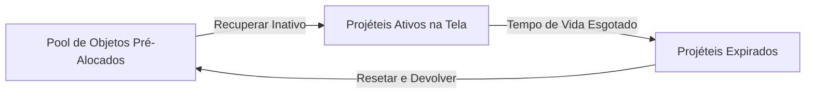

# Skill: Otimização AAA – Object Pooling, Canvas Rendering e GC Zero
## Especialidade: Senior Game Optimization Architect (senior-game-opt)

---

## 1. Introdução: O Gargalo de Performance e Guttering em Jogos HTML5

Em jogos que rodam na thread principal do navegador via Canvas 2D (como *Danger Ghost*), a consistência da taxa de quadros (Frame Rate Stability) é o fator mais crítico para a experiência do usuário (Gamefeel). 

A análise técnica do monólito revelou três gargalos que impedem o jogo de atingir performance fluida de nível AAA (60fps/120fps travados):
1. **Pressão Extrema sobre o Garbage Collector (GC)**: A criação dinâmica de projéteis (`fireProjectile`) e partículas de explosão (`createExplosionEffect`) gera milhares de objetos JS por segundo, que são descartados via `splice`. Isso força o motor de JavaScript do navegador a interromper periodicamente a execução para coletar lixo, gerando micro-stuttering (engasgos).
2. **Redesenho Redundante do Cenário (Tilemap Drawing)**: A cada frame, o método `map.draw()` percorre uma matriz bidimensional inteira desenhando bloco por bloco na tela. Para mapas estáticos, isso desperdiça ciclos de CPU/GPU processando chamadas repetidas de `drawImage`.
3. **Ausência de Interpolamento Visual**: Sem o cálculo do fator residual do acumulador físico ($\alpha$), a movimentação dos sprites pode parecer "trêmula" (jittering) em telas de alta frequência, pois os ticks de renderização física e de desenho não estão alinhados matematicamente.

---

## 2. Blueprint 1: Object Pooling (Projéteis e Partículas)

O **Object Pool** é um padrão de design de software que pré-aloca uma coleção de objetos reusáveis em vez de instanciá-los e destruí-los dinamicamente. Quando um projétil ou partícula expira, ele não é excluído da memória; em vez disso, é marcado como "inativo" para ser reutilizado na próxima invocação.



### Implementação de Referência (TypeScript)

Abaixo está o design de um pool genérico e altamente otimizado para projéteis e partículas.

```typescript
// src/optimization/ObjectPool.ts

export interface Poolable {
    isActive: boolean;
    reset(...args: any[]): void;
}

export class ObjectPool<T extends Poolable> {
    private pool: T[];
    private factory: () => T;
    private maxSize: number;

    constructor(factory: () => T, initialSize: number, maxSize: number = 1000) {
        this.factory = factory;
        this.maxSize = maxSize;
        this.pool = new Array<T>(initialSize);
        
        // Pré-alocar objetos na inicialização (evita GC no meio do jogo)
        for (let i = 0; i < initialSize; i++) {
            this.pool[i] = this.factory();
            this.pool[i].isActive = false;
        }
    }

    /**
     * Obtém um objeto livre do pool ou cria um novo se necessário
     */
    public spawn(...args: any[]): T {
        // 1. Procurar por um objeto inativo no pool
        for (let i = 0; i < this.pool.length; i++) {
            if (!this.pool[i].isActive) {
                const obj = this.pool[i];
                obj.reset(...args);
                obj.isActive = true;
                return obj;
            }
        }

        // 2. Se não houver inativos e o pool puder crescer, criar novo
        if (this.pool.length < this.maxSize) {
            const obj = this.factory();
            obj.reset(...args);
            obj.isActive = true;
            this.pool.push(obj);
            return obj;
        }

        // 3. Fallback: Sobrescreve o primeiro objeto (prevenção contra estouro)
        const fallbackObj = this.pool[0];
        fallbackObj.reset(...args);
        fallbackObj.isActive = true;
        return fallbackObj;
    }

    /**
     * Retorna todos os objetos ativos para atualização e renderização
     */
    public getActiveObjects(): T[] {
        return this.pool.filter(obj => obj.isActive);
    }
}
```

### Aplicação Prática: Projéteis Otimizados
```typescript
export class Projectile implements Poolable {
    public x: number = 0;
    public y: number = 0;
    public vx: number = 0;
    public vy: number = 0;
    public life: number = 0;
    public isActive: boolean = false;

    public reset(x: number, y: number, vx: number, vy: number, life: number): void {
        this.x = x;
        this.y = y;
        this.vx = vx;
        this.vy = vy;
        this.life = life;
    }

    public update(dt: number): void {
        this.x += this.vx * dt;
        this.y += this.vy * dt;
        this.life -= dt;
        if (this.life <= 0) {
            this.isActive = false; // Retorna automaticamente ao pool
        }
    }
}
```

---

## 3. Blueprint 2: Otimização de Canvas Rendering (Double Buffering e Offscreen Canvas)

No Canvas 2D do HTML5, desenhar milhares de imagens estáticas consome largura de banda considerável na CPU. A técnica de **Offscreen Canvas** (Prerendering) desenha o mapa de blocos (tilemap) apenas uma vez em um canvas invisível na memória. 

Durante o loop de rendering ativo do jogo, desenhamos a imagem consolidada do Offscreen Canvas diretamente na tela com uma única instrução `drawImage`.

```mermaid
graph TD
    Map[Matriz do Mapa de Blocos 2D] -->|Desenhar uma única vez| Offscreen[Offscreen Canvas Buffer]
    Offscreen -->|DrawImage com offset X/Y| Screen[Canvas do Jogo (Screen)]
```

### Implementação de Referência (TypeScript)

```typescript
// src/optimization/MapRenderer.ts

export class AAAStaticMapRenderer {
    private offscreenCanvas: HTMLCanvasElement;
    private offscreenCtx: CanvasRenderingContext2D;
    private tileWidth: number = 24;
    private tileHeight: number = 24;
    private mapWidth: number;
    private mapHeight: number;
    private isDirty: boolean = true;

    constructor(cols: number, rows: number) {
        this.mapWidth = cols * this.tileWidth;
        this.mapHeight = rows * this.tileHeight;

        // Criar o buffer offscreen
        this.offscreenCanvas = document.createElement("canvas");
        this.offscreenCanvas.width = this.mapWidth;
        this.offscreenCanvas.height = this.mapHeight;
        this.offscreenCtx = this.offscreenCanvas.getContext("2d")!;
    }

    /**
     * Força a reconstrução do mapa estático apenas se houver mudanças (dirty flag pattern)
     */
    public prerenderMap(bitmap: number[][], tileSprites: HTMLImageElement): void {
        if (!this.isDirty) return;

        this.offscreenCtx.clearRect(0, 0, this.mapWidth, this.mapHeight);

        for (let r = 0; r < bitmap.length; r++) {
            for (let c = 0; c < bitmap[r].length; c++) {
                const tileId = bitmap[r][c];
                if (tileId !== 0) {
                    // Desenhar fatia do sprite-sheet no buffer
                    const sx = (tileId % 8) * this.tileWidth;
                    const sy = Math.floor(tileId / 8) * this.tileHeight;
                    
                    // Alinhamento de Pixel Inteiro para evitar antialiasing sub-pixel
                    this.offscreenCtx.drawImage(
                        tileSprites,
                        sx, sy, this.tileWidth, this.tileHeight,
                        c * this.tileWidth, r * this.tileHeight, this.tileWidth, this.tileHeight
                    );
                }
            }
        }

        this.isDirty = false;
    }

    /**
     * Renderiza o buffer pré-compilado na tela principal em O(1) draw calls
     */
    public draw(mainCtx: CanvasRenderingContext2D, mapOffsetX: number): void {
        // Bitwise OR (| 0) ou Bitwise NOT (~~) para arredondar coordenadas para inteiros de forma ultrarápida
        const renderX = (mapOffsetX) | 0;
        
        mainCtx.drawImage(
            this.offscreenCanvas,
            -renderX, 0, mainCtx.canvas.width, mainCtx.canvas.height, // Retângulo de origem visível
            0, 0, mainCtx.canvas.width, mainCtx.canvas.height         // Retângulo de destino
        );
    }

    public invalidate(): void {
        this.isDirty = true;
    }
}
```

---

## 4. Blueprint 3: Zero-GC Loop (Redução de Alocação de Memória)

Para eliminar engasgos causados por coleta de lixo, os métodos chamados no ciclo crítico do loop principal (Update/Render) **nunca** devem instanciar objetos locais temporários.

### Diretrizes Antialocação
1. **Evitar literais de objetos**: Em vez de passar coordenadas como `{x, y}`, declare variáveis separadas ou reuse uma única instância de vetor global.
2. **Reuso de Arrays**: Limpe arrays utilizando `array.length = 0` em vez de redefinir `array = []` (o que descarta o array antigo para o GC).
3. **Estruturas Estáticas de Efeitos**: Pré-aloque os arrays de partículas na inicialização da aplicação.

```typescript
// Padrão RUIM (Gera lixo para GC)
function checkCollision(pos: { x: number; y: number }) {
    const box = { minX: pos.x - 10, maxX: pos.x + 10 }; // Aloca 2 objetos
    return box.minX > 0;
}

// Padrão AAA Otimizado (GC Zero)
class Vector2D {
    public x: number = 0;
    public y: number = 0;
}

// Único cache reutilizável globalmente na thread do jogo
const COLLISION_CACHE_BOX = { minX: 0, maxX: 0 };

function checkCollisionAAA(x: number, y: number): boolean {
    COLLISION_CACHE_BOX.minX = x - 10;
    COLLISION_CACHE_BOX.maxX = x + 10;
    return COLLISION_CACHE_BOX.minX > 0;
}
```

---

## 5. Blueprint 4: Estabilização de Framerate com Interpolador Visual

Ao rodar física com acumulador fixo ($dt$), a taxa de frames do monitor ($\Delta t_{\text{render}}$) quase nunca se divide perfeitamente por $dt$. Isso gera o efeito de lag temporal discreto.

Para suavizar os movimentos, calculamos a fração de tempo restante no acumulador e a usamos para interpolar linearmente a posição visual entre o frame anterior e o atual.

### 5.1. Matemática da Interpolação Linear (LERP)
Dadas a posição física do frame anterior ($x_{\text{prev}}$) e a do frame atual ($x_{\text{curr}}$):

$$\alpha = \frac{\text{accumulator}}{dt}$$
$$x_{\text{render}} = x_{\text{prev}} + \alpha \cdot (x_{\text{curr}} - x_{\text{prev}})$$

### 5.2. Loop de Jogo com Suporte a Interpolação (TypeScript)

```typescript
// src/optimization/GameLoop.ts

export class AAAGameLoop {
    private dt: number = 1 / 60; // Física fixa de 16.66ms
    private accumulator: number = 0;
    private lastTime: number = 0;

    // Estados físicos para interpolação
    private playerXPrev: number = 48;
    private playerXCurr: number = 48;

    public tick(currentTime: number): void {
        const frameTime = (currentTime - this.lastTime) / 1000;
        this.lastTime = currentTime;

        // Limite para evitar espiral da morte
        const clampedFrameTime = Math.min(frameTime, 0.25);
        this.accumulator += clampedFrameTime;

        while (this.accumulator >= this.dt) {
            // Salvar estado físico anterior
            this.playerXPrev = this.playerXCurr;

            // Executar atualização física
            this.physicsUpdate(this.dt);

            this.accumulator -= this.dt;
        }

        // Calcular fator de interpolação alpha (entre 0.0 e 1.0)
        const alpha = this.accumulator / this.dt;

        // Interpolar visualmente a posição do jogador para a renderização
        const renderX = this.playerXPrev + alpha * (this.playerXCurr - this.playerXPrev);

        this.draw(renderX);
    }

    private physicsUpdate(dt: number): void {
        const speed = 100; // pixels por segundo
        this.playerXCurr += speed * dt; // Física atualiza estado corrente
    }

    private draw(interpolatedX: number): void {
        // Renderizar o sprite na coordenada interpolada suave
        // drawImage(..., interpolatedX | 0, ...);
    }
}
```
