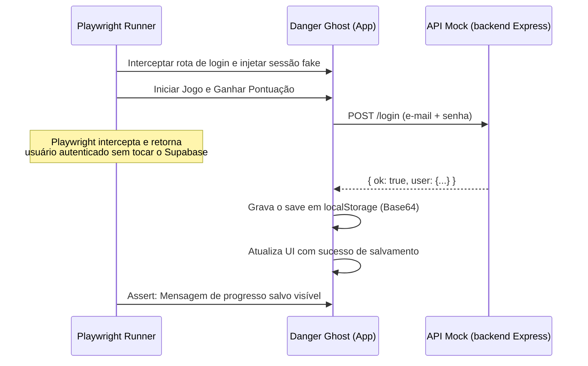

# Skill: Automação de Testes QA e Prevenção de XSS
## Especialidade: Senior QA Expert (senior-qa-expert)

---

## 1. Introdução: Limitações da Simulação JSDOM e Riscos de Segurança

O ambiente de testes atual em *Danger Ghost* baseia-se em emulações leves com `JSDOM` (`test_jsdom_errors.js`). Embora seja rápido para verificar erros de sintaxe básicos, apresenta lacunas severas de garantia de qualidade:
1. **Mocking Estático Incompleto**: Não testa interações visuais complexas, como renderização real no canvas HTML5, colisões sob taxas de quadros oscilantes e timing de sincronização de áudio.
2. **Fidelidade de Rede e Sessão**: o JSDOM não reproduz o comportamento real de `fetch`, cookies e sessão do navegador contra o backend (Express + Socket.io), então falhas de auth e de sync de save passam despercebidas.
3. **Vulnerabilidade a XSS Armazenado (Cross-Site Scripting)**: na exibição do ranking global (Leaderboard) e no chat global, o jogo renderiza no HTML nomes de usuário vindos do servidor. Se um jogador registrar um nome malicioso (ex: ``) e o escape falhar, a conta de todos que virem o placar pode ser comprometida.

---

## 2. Abordagem de Testes AAA: E2E com Playwright

A automação de nível AAA exige testes de ponta a ponta (E2E) rodando em navegadores reais (Chromium, Firefox, WebKit) via **Playwright**. Isso nos permite auditar o comportamento real da física, do canvas, do áudio e de injeções de script no DOM.

### 2.1. Arquitetura de Intercepção e Mocking de Auth
Testes de CI/CD não podem depender do Supabase real nem criar contas de verdade a cada rodada. O Playwright intercepta as chamadas de autenticação do cliente e devolve uma sessão simulada, deixando o save local (`localStorage`) rodar de ponta a ponta sem rede.



---

## 3. Guia de Configuração e Escrita de Testes (TypeScript)

Abaixo está o setup completo de testes E2E para o Playwright.

### 3.1. Configuração do Playwright (`playwright.config.ts`)
```typescript
import { defineConfig, devices } from "@playwright/test";

export default defineConfig({
  testDir: "./tests",
  fullyParallel: true,
  forbidOnly: !!process.env.CI,
  retries: process.env.CI ? 2 : 0,
  workers: process.env.CI ? 1 : undefined,
  reporter: "html",
  use: {
    baseURL: "http://localhost:8080",
    trace: "on-first-retry",
    screenshot: "only-on-failure",
  },
  projects: [
    {
      name: "chromium",
      use: { ...devices["Desktop Chrome"] },
    },
  ],
  webServer: {
    command: "npx http-server ./danger\\ ghost -p 8080",
    url: "http://localhost:8080",
    reuseExistingServer: !process.env.CI,
  },
});
```

### 3.2. Suíte de Testes E2E, Mock de Auth e Scanner de XSS (`tests/game.spec.ts`)
```typescript
import { test, expect, Page } from "@playwright/test";

const MOCK_USER = { id: 1, email: "qa@dangerghost.test", username: "QA_Runner" };

/**
 * Intercepta o login local de e-mail/senha e devolve uma sessão autenticada,
 * sem tocar o backend nem o Supabase real.
 */
async function mockLocalAuth(page: Page) {
  await page.route("**/login", async (route) => {
    await route.fulfill({ json: { ok: true, user: MOCK_USER } });
  });

  await page.addInitScript((user) => {
    // Estado de sessão que o cliente espera encontrar já logado
    (window as any).g_currentUser = user;
  }, MOCK_USER);
}

test.describe("Danger Ghost - Suíte de Testes AAA & Segurança", () => {
  
  test.beforeEach(async ({ page }) => {
    await mockLocalAuth(page);
    await page.goto("/");
  });

  test("Deve inicializar o jogo autenticado e carregar HUD", async ({ page }) => {
    const statusHeader = page.locator("#rpgPanelContent h3");
    await expect(statusHeader).toBeVisible();
    await expect(statusHeader).toHaveText("🛡️ HERO STATUS");
  });

  test("Deve prevenir injeção de HTML/XSS no campo de nome do jogador e leaderboard", async ({ page }) => {
    // Payload malicioso contendo tag HTML ativa
    const xssPayload = "";
    
    // Simular preenchimento do nome e gravação no ranking local
    await page.evaluate((payload) => {
      const nameInput = document.getElementById("playerNameInput") as HTMLInputElement;
      if (nameInput) {
        nameInput.value = payload;
      }
      
      // Chamar função de escape simulando o salvamento
      const escaped = (window as any).escapeHTML 
        ? (window as any).escapeHTML(payload) 
        : payload.replace(/</g, "&lt;").replace(/>/g, "&gt;");
        
      const leaderboardDiv = document.createElement("div");
      leaderboardDiv.id = "test-leaderboard-slot";
      leaderboardDiv.innerHTML = escaped; // Se escapou, a tag img não executará
      document.body.appendChild(leaderboardDiv);
    }, xssPayload);

    // Verificar se a tag img foi escapada textualmente
    const slot = page.locator("#test-leaderboard-slot");
    await expect(slot).toHaveText(xssPayload);

    // Avaliar se o script do payload NÃO rodou no navegador
    const isXssTriggered = await page.evaluate(() => (window as any).XSS_DETECTED || false);
    expect(isXssTriggered).toBe(false);
  });

  test("Deve processar a resposta física do pulo sob simulação de loop", async ({ page }) => {
    // Testar se as teclas alteram os estados internos do jogador sem crash
    await page.keyboard.down("ArrowRight");
    await page.waitForTimeout(100);
    
    const xPos = await page.evaluate(() => (window as any).DeSoGhost.xPos);
    expect(xPos).toBeGreaterThan(48); // Jogador deve ter se movido
  });
});
```

---

## 4. Estratégias de Sanitização de Entradas (Anti-XSS)

<!-- TODO(security-engineer): esta seção é uma referência teórica escrita fora do código. Verificar contra o código ao vivo se `escapeHTML` existe de fato, onde é chamado, e se o leaderboard e o chat global realmente passam por ele antes de qualquer `.innerHTML`. -->

A injeção de strings maliciosas ocorre quando o código do jogo utiliza `.innerHTML` para inserir dados vindos do servidor (nomes no leaderboard, mensagens do chat global) sem tratamento.

### 4.1. Função de Sanitização Robusta
Para anular injeções em nível de produção, substitua rotinas frágeis pela sanitização baseada em whitelist ou utilize APIs nativas seguras.

```typescript
// src/utils/Sanitizer.ts

export class Sanitizer {
    /**
     * Escapa caracteres perigosos de strings dinâmicas antes de renderizá-las no DOM
     */
    public static escapeHTML(str: string): string {
        if (!str) return "";
        return str
            .replace(/&/g, "&amp;")
            .replace(/</g, "&lt;")
            .replace(/>/g, "&gt;")
            .replace(/"/g, "&quot;")
            .replace(/'/g, "&#x27;")
            .replace(/\//g, "&#x2F;")
            .replace(/`/g, "&#96;");
    }

    /**
     * Alternativa limpa: Cria elementos de texto puro utilizando textContent
     */
    public static safeAppendText(parent: HTMLElement, text: string, className?: string): void {
        const span = document.createElement("span");
        if (className) span.className = className;
        span.textContent = text; // Impede qualquer execução de tag script/html
        parent.appendChild(span);
    }
}
```
