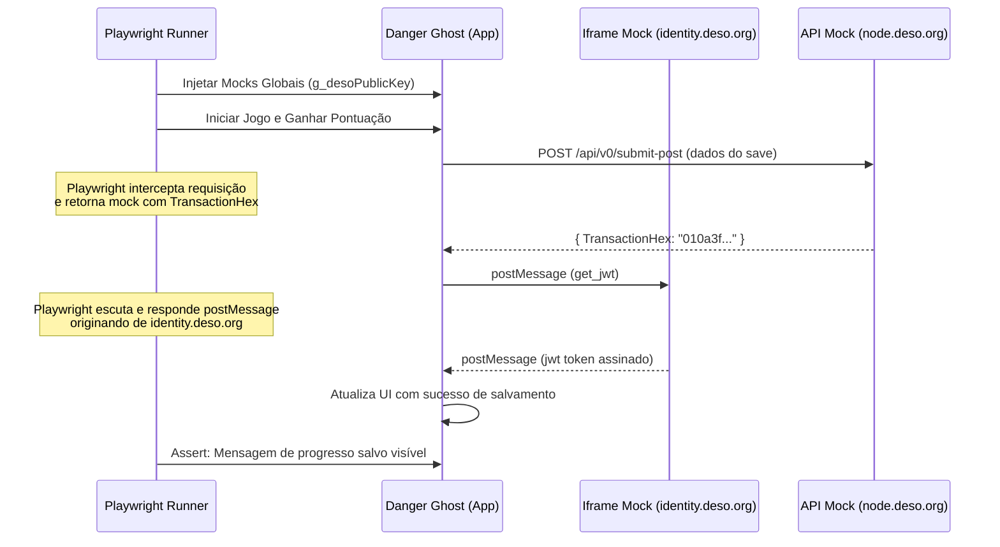

# Skill: Automação de Testes QA, Mocks Web3 e Prevenção de XSS
## Especialidade: Senior QA Expert (senior-qa-expert)

---

## 1. Introdução: Limitações da Simulação JSDOM e Riscos de Segurança

O ambiente de testes atual em *Danger Ghost* baseia-se em emulações leves com `JSDOM` (`test_jsdom_errors.js`). Embora seja rápido para verificar erros de sintaxe básicos, apresenta lacunas severas de garantia de qualidade:
1. **Mocking Estático Incompleto**: Não testa interações visuais complexas, como renderização real no canvas HTML5, colisões sob taxas de quadros oscilantes e timing de sincronização de áudio.
2. **Ignorância da Comunicação Cross-Origin**: O jogo se comunica com o iframe `identity.deso.org` por meio de `window.postMessage`. O JSDOM não simula com fidelidade a segurança de origem do navegador, sandboxing de iframes e restrições de referenciadores.
3. **Vulnerabilidade a XSS Armazenado (Cross-Site Scripting)**: Na exibição do ranking global (Leaderboard), o jogo extrai os nomes de usuários inseridos via inputs on-chain e os renderiza no HTML. Se um atacante subir uma transação com um nome malicioso (ex: ``), e o sistema de escape falhar, a conta de todos os jogadores que visualizarem o placar pode ser comprometida.

---

## 2. Abordagem de Testes AAA: E2E com Playwright

A automação de nível AAA exige testes de ponta a ponta (E2E) rodando em navegadores reais (Chromium, Firefox, WebKit) via **Playwright**. Isso nos permite auditar o comportamento real da física, do canvas, do áudio e de injeções de script no DOM.

### 2.1. Arquitetura de Intercepção e Mocking Web3
Como não podemos realizar transações financeiras reais ou depender da rede DeSo ativa durante testes de CI/CD, o Playwright interceptará chamadas de rede e simulará as respostas do iframe de identidade.



---

## 3. Guia de Configuração e Escrita de Testes (TypeScript)

Abaixo está o setup completo de testes E2E para o Playwright.

### 3.1. Configuração do Playwright (`playwright.config.ts`)
```typescript
import { defineConfig, devices } from "@playwright/test";

export default defineConfig({
  testDir: "./tests",
  fullyParallel: true,
  forbidOnly: !!process.env.CI,
  retries: process.env.CI ? 2 : 0,
  workers: process.env.CI ? 1 : undefined,
  reporter: "html",
  use: {
    baseURL: "http://localhost:8080",
    trace: "on-first-retry",
    screenshot: "only-on-failure",
  },
  projects: [
    {
      name: "chromium",
      use: { ...devices["Desktop Chrome"] },
    },
  ],
  webServer: {
    command: "npx http-server ./danger\\ ghost -p 8080",
    url: "http://localhost:8080",
    reuseExistingServer: !process.env.CI,
  },
});
```

### 3.2. Suíte de Testes E2E, Mocks Web3 e Scanner de XSS (`tests/game.spec.ts`)
```typescript
import { test, expect, Page } from "@playwright/test";

// Mock da Chave Pública de Testes
const MOCK_PUBLIC_KEY = "BC1YLheA3Zd65n6sE7364s7E63d76as73d6as73d6asd7a";

/**
 * Injeta o comportamento simulado do Iframe do DeSo Identity
 */
async function mockDeSoIdentity(page: Page) {
  await page.addInitScript((publicKey) => {
    // Escuta mensagens enviadas ao window
    window.addEventListener("message", (event) => {
      if (event.origin !== "https://identity.deso.org") return;
      
      const data = event.data;
      if (data && data.method === "jwt") {
        // Responder simulando a aprovação e assinatura de JWT pelo iframe
        window.postMessage(
          {
            id: data.id,
            service: "identity",
            payload: {
              jwt: "eyJhbGciOiJFUzI1NiIsInR5cCI6IkpXVCJ9.mockPayload.mockSignature"
            }
          },
          "*"
        );
      }
    });

    // Mock das propriedades de login no objeto global
    (window as any).g_desoPublicKey = publicKey;
    (window as any).g_desoUserObj = {
      accessLevel: 4,
      accessLevelHmac: "hmachash",
      encryptedSeedHex: "seedhex"
    };
  }, MOCK_PUBLIC_KEY);
}

test.describe("Danger Ghost - Suíte de Testes AAA & Segurança", () => {
  
  test.beforeEach(async ({ page }) => {
    // Interceptar e simular chamadas de API do Nó DeSo
    await page.route("https://node.deso.org/api/v0/submit-post", async (route) => {
      const json = {
        TransactionHex: "f1a23b4c5d6e",
        PostHashHex: "posthashhex123456789"
      };
      await route.fulfill({ json });
    });

    await page.route("https://node.deso.org/api/v0/upload-image", async (route) => {
      await route.fulfill({
        json: { ImageURL: "https://images.deso.org/mocked_ghost.jpg" }
      });
    });

    // Configurar mocks do Identity
    await mockDeSoIdentity(page);
    await page.goto("/");
  });

  test("Deve inicializar o jogo com carteira conectada e carregar HUD", async ({ page }) => {
    // Verificar se o botão de conectar DeSo mudou para o painel de status do herói
    const statusHeader = page.locator("#rpgPanelContent h3");
    await expect(statusHeader).toBeVisible();
    await expect(statusHeader).toHaveText("🛡️ HERO STATUS");
  });

  test("Deve prevenir injeção de HTML/XSS no campo de nome do jogador e leaderboard", async ({ page }) => {
    // Payload malicioso contendo tag HTML ativa
    const xssPayload = "";
    
    // Simular preenchimento do nome e gravação no ranking local
    await page.evaluate((payload) => {
      const nameInput = document.getElementById("playerNameInput") as HTMLInputElement;
      if (nameInput) {
        nameInput.value = payload;
      }
      
      // Chamar função de escape simulando o salvamento
      const escaped = (window as any).escapeHTML 
        ? (window as any).escapeHTML(payload) 
        : payload.replace(/</g, "&lt;").replace(/>/g, "&gt;");
        
      const leaderboardDiv = document.createElement("div");
      leaderboardDiv.id = "test-leaderboard-slot";
      leaderboardDiv.innerHTML = escaped; // Se escapou, a tag img não executará
      document.body.appendChild(leaderboardDiv);
    }, xssPayload);

    // Verificar se a tag img foi escapada textualmente
    const slot = page.locator("#test-leaderboard-slot");
    await expect(slot).toHaveText(xssPayload);

    // Avaliar se o script do payload NÃO rodou no navegador
    const isXssTriggered = await page.evaluate(() => (window as any).XSS_DETECTED || false);
    expect(isXssTriggered).toBe(false);
  });

  test("Deve processar a resposta física do pulo sob simulação de loop", async ({ page }) => {
    // Testar se as teclas alteram os estados internos do jogador sem crash
    await page.keyboard.down("ArrowRight");
    await page.waitForTimeout(100);
    
    const xPos = await page.evaluate(() => (window as any).DeSoGhost.xPos);
    expect(xPos).toBeGreaterThan(48); // Jogador deve ter se movido
  });
});
```

---

## 4. Estratégias de Sanitização de Entradas (Anti-XSS)

A injeção de strings maliciosas ocorre quando o código do jogo utiliza `.innerHTML` para inserir dados obtidos da rede (como o feed de posts do blockchain DeSo) sem tratamento.

### 4.1. Função de Sanitização Robusta
Para anular injeções em nível de produção, substitua rotinas frágeis pela sanitização baseada em whitelist ou utilize APIs nativas seguras.

```typescript
// src/utils/Sanitizer.ts

export class Sanitizer {
    /**
     * Escapa caracteres perigosos de strings dinâmicas antes de renderizá-las no DOM
     */
    public static escapeHTML(str: string): string {
        if (!str) return "";
        return str
            .replace(/&/g, "&amp;")
            .replace(/</g, "&lt;")
            .replace(/>/g, "&gt;")
            .replace(/"/g, "&quot;")
            .replace(/'/g, "&#x27;")
            .replace(/\//g, "&#x2F;")
            .replace(/`/g, "&#96;");
    }

    /**
     * Alternativa limpa: Cria elementos de texto puro utilizando textContent
     */
    public static safeAppendText(parent: HTMLElement, text: string, className?: string): void {
        const span = document.createElement("span");
        if (className) span.className = className;
        span.textContent = text; // Impede qualquer execução de tag script/html
        parent.appendChild(span);
    }
}
```

---

## 5. Sandboxing e Política de Segurança de Conteúdo (CSP)

Para mitigar danos em caso de vazamento de credenciais ou vulnerabilidades de XSS remanescentes, adote cabeçalhos HTTP de segurança estritos e sandboxing de iframes.

### 5.1. Tag Meta CSP Recomendada para o `index.html`
```html
<meta http-equiv="Content-Security-Policy" content="
  default-src 'self';
  script-src 'self' 'unsafe-inline' https://identity.deso.org;
  style-src 'self' 'unsafe-inline' https://fonts.googleapis.com;
  img-src 'self' data: https://images.deso.org https://node.deso.org;
  connect-src 'self' https://node.deso.org https://identity.deso.org;
  frame-src 'self' https://identity.deso.org;
  sandbox allow-forms allow-scripts allow-popups allow-same-origin;
">
```
- **`frame-src`**: Restringe os iframes permitidos apenas para a origem do DeSo Identity.
- **`sandbox`**: Impede que scripts injetados acessem cookies de outras páginas ou executem plugins inseguros de terceiros.
- **`connect-src`**: Restringe requisições de rede (fetch/xhr) apenas para nós DeSo oficiais.
