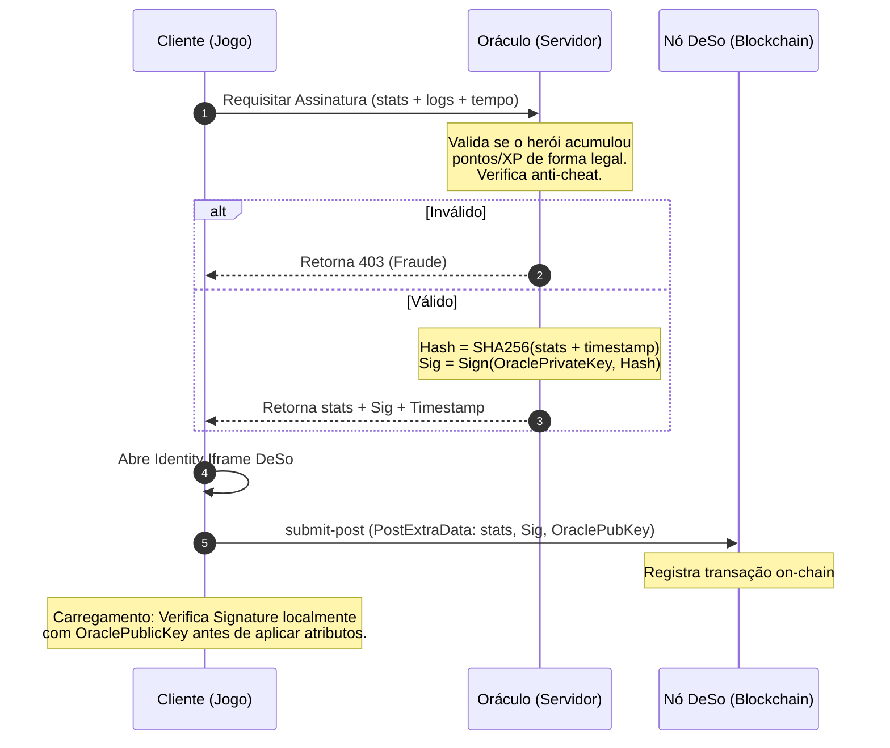

# Skill: Segurança Web3, Criptografia Assimétrica e Validação de Oráculo
## Especialidade: Senior Web3 Developer (senior-web3-dev)

---

## 1. Introdução: Vulnerabilidades Fatais na Integração Web3 Atual

A arquitetura atual do jogo *Danger Ghost* delega ao cliente (navegador do usuário) a responsabilidade de compilar e publicar o estado do jogo na blockchain DeSo:

```javascript
// Modelo Atual Vulnerável
var postReq = {
    PostExtraData: {
        "DangerGhost_CharacterID": stats.characterId,
        "DangerGhost_SaveState": btoa(JSON.stringify(stats)),
        "DangerGhost_GameApp": "v1.0.0"
    }
};
```

Esse modelo apresenta vulnerabilidades críticas:
1. **Falta de Autoridade (Falsificação de Estado)**: Como não há validação criptográfica no servidor/oráculo das conquistas do jogador, qualquer usuário pode abrir o console de desenvolvedor, alterar o objeto `stats` (ex: `stats.level = 99999`) e submeter a transação para a DeSo. A blockchain registrará e indexará a transação, e o jogo lerá o save forjado como legítimo.
2. **Ignorância da Criptografia de Assinatura**: O save em base64 (`DangerGhost_SaveState`) não contém comprovação de autoria do motor do jogo. O cliente assume que qualquer dado lido da blockchain associado à chave pública é válido.
3. **Bypass de Token-Gating**: O bloqueio de recursos exclusivos (como portas VIP baseadas em moedas de criador `$DangerGhost`) é validado puramente por JavaScript local (`if (!window.g_hasCreatorCoin)`), o que é facilmente burlado alterando a variável local na memória do navegador.

---

## 2. A Solução: Arquitetura com Oráculo de Validação

Para elevar o jogo ao nível AAA de segurança Web3, o cliente **nunca** deve salvar dados diretamente na blockchain sem antes obter uma assinatura de transação ou de payload gerada por um **Oráculo Autorizativo Off-chain**.

### 2.1. O Fluxo de Assinatura ECDSA
A criptografia assimétrica de curva elíptica baseia-se na curva **secp256k1** (a mesma utilizada pelo Bitcoin, Ethereum e DeSo). 

1. O Oráculo possui um par de chaves: uma **Chave Privada** ($d$) mantida em segredo absoluto no servidor (guardada em HSM ou variável de ambiente segura) e uma **Chave Pública** ($Q = d \times G$) embutida no cliente do jogo.
2. Ao atingir um marco ou salvar o jogo, o cliente envia as estatísticas cruas junto com evidências (ex: logs de inputs, hash de colisão, tempo da partida) para o Oráculo.
3. O Oráculo valida se o progresso é fisicamente possível (ex: conferindo se o ganho de XP faz sentido com o tempo gasto na partida).
4. Se legítimo, o Oráculo serializa as estatísticas, gera um hash binário dessa mensagem (usando SHA-256) e assina esse hash usando **ECDSA** (Elliptic Curve Digital Signature Algorithm), gerando o par $(r, s)$:

$$\text{Hash} = H(\text{Metadata})$$
$$\text{Assinatura} = \text{ECDSA\_Sign}(d, \text{Hash})$$

5. O Oráculo retorna a assinatura e os dados validados ao cliente.
6. O cliente submete a transação para a DeSo contendo o payload e a assinatura no `PostExtraData`.
7. Ao carregar o jogo, o cliente (e outros servidores de ranking) lê o payload, reconstrói o hash e valida a assinatura usando a chave pública do Oráculo ($Q$). Qualquer alteração de bits no payload invalidará a verificação criptográfica.



---

## 3. Implementação do Oráculo (Node.js/TypeScript)

Código executado em ambiente de backend seguro (Server-side) para validação e assinatura do progresso do jogador.

```typescript
// server/src/services/OracleService.ts
import * as crypto from "crypto";
import { ec as EC } from "elliptic";

const ec = new EC("secp256k1");

export interface GameSaveState {
    characterId: string;
    level: number;
    vit: number;
    agi: number;
    int: number;
    pow: number;
    mag: number;
    xp: number;
    score: number;
    timestamp: number;
}

export class OracleService {
    // Chave privada do Oráculo carregada de variáveis de ambiente seguras
    private privateKeyHex: string;

    constructor() {
        this.privateKeyHex = process.env.ORACLE_PRIVATE_KEY || "";
        if (!this.privateKeyHex || this.privateKeyHex.length !== 64) {
            throw new Error("Chave privada do Oráculo ausente ou inválida.");
        }
    }

    /**
     * Valida logicamente se os atributos e progresso fazem sentido físico temporário
     */
    public validateProgress(previousState: GameSaveState | null, nextState: GameSaveState, clientInputsHash: string): boolean {
        // 1. Prevenir manipulação de atributos negativos
        if (nextState.vit < 1 || nextState.agi < 1 || nextState.int < 1 || nextState.pow < 1 || nextState.mag < 1) {
            return false;
        }

        // 2. Prevenir saltos de nível inconsistentes com o tempo
        if (previousState) {
            const timeDelta = (nextState.timestamp - previousState.timestamp) / 1000; // segundos
            const xpGained = nextState.xp - previousState.xp + (nextState.level > previousState.level ? (nextState.level - previousState.level) * 100 : 0);
            
            // Taxa máxima física teórica de ganho de XP (ex: 50 XP/s)
            const maxTheoreticalXpPerSec = 50;
            if (xpGained / timeDelta > maxTheoreticalXpPerSec) {
                return false; // Ganho de XP muito rápido (Cheat detectado)
            }
        }

        return true;
    }

    /**
     * Assina criptograficamente o estado de salvamento com a chave do Oráculo
     */
    public generateSaveSignature(state: GameSaveState): string {
        const key = ec.keyFromPrivate(this.privateKeyHex, "hex");
        
        // Serialização determinística dos dados vitais (Evitando problemas de espaços em branco do JSON)
        const message = [
            state.characterId,
            state.level,
            state.vit,
            state.agi,
            state.int,
            state.pow,
            state.mag,
            state.xp,
            state.score,
            state.timestamp
        ].join("|");

        // Hash binário SHA-256
        const hash = crypto.createHash("sha256").update(message).digest();
        
        // Assinatura ECDSA
        const signature = key.sign(hash);
        
        // Retorna a assinatura em formato Hexadecimal DER
        return signature.toDER("hex");
    }
}
```

---

## 4. Validação no Cliente (TypeScript)

Código integrado ao cliente do jogo (Frontend) para assegurar a integridade dos dados obtidos da blockchain antes de aplicar ao herói ativo.

```typescript
// src/web3/SaveVerifier.ts
import { ec as EC } from "elliptic";
const ec = new EC("secp256k1");

export interface GameSavePayload {
    characterId: string;
    level: number;
    vit: number;
    agi: number;
    int: number;
    pow: number;
    mag: number;
    xp: number;
    score: number;
    timestamp: number;
    signature: string; // DER Hex
}

export class SaveVerifier {
    // Chave pública do Oráculo (derivada da privada, segura para expor publicamente)
    private readonly oraclePublicKeyHex = "0479be667ef9dcbbac55a06295ce870b07029bfcdb2dce28d959f2815b16f81798483ada7726a3c4655da4fbfc0e1108a8fd17b448a68554199c47d08ffb10d4b8";

    /**
     * Verifica se os dados extraídos da blockchain foram assinados pelo oráculo oficial
     */
    public verifySaveState(payload: GameSavePayload): boolean {
        try {
            const key = ec.keyFromPublic(this.oraclePublicKeyHex, "hex");

            // Reconstrói a mensagem de forma determinística
            const message = [
                payload.characterId,
                payload.level,
                payload.vit,
                payload.agi,
                payload.int,
                payload.pow,
                payload.mag,
                payload.xp,
                payload.score,
                payload.timestamp
            ].join("|");

            // Computar hash local equivalente
            // Em navegadores modernos sem Node 'crypto', usar Web Crypto API (SubtleCrypto)
            // Para simplificação de fluxo com elliptic library:
            const msgHash = ec.hash().update(message).digest();

            // Validar assinatura ECDSA contra a chave pública do Oráculo
            const isValid = key.verify(msgHash, payload.signature);

            if (!isValid) {
                console.warn(`[Web3 Security] Assinatura corrompida para o fantasma ${payload.characterId}`);
            }

            return isValid;
        } catch (error) {
            console.error("Falha no processo de verificação criptográfica do save:", error);
            return false;
        }
    }
}
```

---

## 5. Token-Gating Robusto de Creator Coins

Para impedir bypass local de acesso (portas exclusivas a investidores), a validação de moedas e tokens da DeSo deve ocorrer no servidor/oráculo ou através de verificação criptográfica da resposta da API da DeSo com chaves públicas.

### 5.1. Validação Off-chain de Saldo
O cliente solicita um token JWT assinado pela carteira do usuário (via DeSo Identity). O servidor decodifica o JWT para provar a identidade e consulta o saldo de Creator Coins diretamente de um nó confiável:

```typescript
// Exemplo de rota de validação no Oráculo
app.post("/api/verify-vip", async (req, res) => {
    const { userPublicKey, jwt } = req.body;
    
    // 1. Validar assinatura do JWT com a chave do usuário
    const isUserValid = verifyDesoJWT(userPublicKey, jwt);
    if (!isUserValid) {
        return res.status(401).json({ error: "Sessão inválida" });
    }

    // 2. Consultar saldo de moedas no nó oficial da DeSo
    const balanceRes = await fetch("https://node.deso.org/api/v0/get-users-stateless", {
        method: "POST",
        body: JSON.stringify({ PublicKeysBase58Check: [userPublicKey] })
    });
    
    // 3. Verificar se possui Creator Coins suficientes (ex: $DangerGhost > 0.5)
    const userData = await balanceRes.json();
    const hasCoin = checkIfOwnsCreatorCoin(userData, "DangerGhost", 0.5);

    if (hasCoin) {
        // Retorna assinatura autorizando acesso temporário
        const ticketSig = generateAccessTicket(userPublicKey);
        return res.json({ accessGranted: true, ticket: ticketSig });
    } else {
        return res.status(403).json({ error: "Saldo insuficiente do criador" });
    }
});
```
